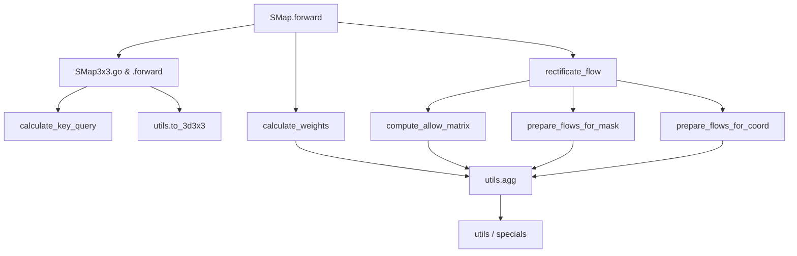

# SMap Knowledge Graph

This knowledge graph is designed to help readers understand the functional structure of `smap.py`, the relationships between its core components, and how the unittests relate to the module's correctness. The graph demonstrates how data and computation flow through the system, highlighting both the architectural logic and the verification points via test cases.

---

## 1. Key Components and Functions in `smap.py`

**Nodes:**
- **SMap (nn.Module)**
  - Main entry point for spatial mapping operations.
- **SMap3x3 (nn.Module)**
  - Core for 3x3 neighborhood processing.
- **flip (function)**
  - Utility for tensor dimension flipping.
- **compute_allow_matrix (method, SMap)**
  - Computes allowed spatial flows.
- **prepare_flows_for_mask (method, SMap)**
  - Prepares flows for mask-based activation.
- **prepare_flows_for_coord (method, SMap)**
  - Prepares flows for coordinate-based activation.
- **calculate_weights (method, SMap)**
  - Aggregates and selects weights for output.
- **rectificate_flow (method, SMap)**
  - Applies rectification logic and computes final flows and gradients.
- **forward (method, SMap and SMap3x3)**
  - Performs the main forward/inference pass.
- **calculate_key_query (method, SMap3x3)**
  - Calculates matching between keys and queries for 3D mapping.
- **go (method, SMap3x3)**
  - Adds padding and prepares batch for processing.
- **utils, specials**
  - Utility and special constant modules.

---

## 2. Knowledge Graph Diagram (Textual Form)

```
[SMap]
  |-- forward
  |     |-- SMap3x3.go
  |     |-- SMap3x3.forward
  |     |     |-- calculate_key_query
  |     |     |-- [utils.to_3d3x3]
  |     |
  |     |-- calculate_weights
  |     |     |-- [utils.agg]
  |     |
  |     |-- rectificate_flow
  |           |-- compute_allow_matrix
  |           |     |-- [utils.agg, flip]
  |           |-- prepare_flows_for_mask
  |           |     |-- [utils.agg]
  |           |-- prepare_flows_for_coord
  |                 |-- [utils.agg]
  |
  |-- compute_allow_matrix
  |-- prepare_flows_for_mask
  |-- prepare_flows_for_coord
  |-- calculate_weights
  |-- rectificate_flow

[SMap3x3]
  |-- go
  |-- forward
  |-- calculate_key_query

[flip] (utility)
[utils], [specials] (dependencies)
```

### Explanation

- **SMap** is the main orchestrator, calling into SMap3x3 for local (3x3) spatial reasoning.
- **SMap3x3.forward** depends on `calculate_key_query` for key-query matching, which itself uses `utils.to_3d3x3`.
- The **rectification** and **flow preparation** logic are modular, with `compute_allow_matrix`, `prepare_flows_for_mask`, and `prepare_flows_for_coord` all relying on shared utility functions.
- The **weight calculation** uses aggregation and selection logic, and is crucial for producing the final output map.

---

## 3. Test Case Mapping on the Graph

- **test_prepare_flows_for_coord** (utest_smap.py)
  - Validates: `SMap.prepare_flows_for_coord`, indirectly `utils.agg`
  - Ensures correct flow field for given coordinate activations.

- **test_prepare_flows_for_mask** (utest_smap.py)
  - Validates: `SMap.prepare_flows_for_mask`, indirectly `utils.agg`
  - Ensures correct flow field when activating via mask.

- **test_SMap_forward** (utest_smap.py)
  - Validates: `SMap.forward` (main logic), `SMap3x3.go`, `SMap3x3.forward`, `calculate_weights`
  - Ensures spatial mapping from input mask to output is geometrically correct.

- **test_to_3d3x3** (utest_smap3x3.py)
  - Validates: `utils.to_3d3x3`, used in `SMap3x3.calculate_key_query`
  - Ensures correct 3D coordinate transformation.

- **test_agg_factor_only**, **test_agg_ind** (utest_smap3x3.py)
  - Validate: `utils.agg`
  - Ensure aggregation logic for weights and indexing works as intended.

- **test_in_*_stage** (vtest_smap3x3.py)
  - Validate: Gradient propagation and correctness in `SMap.rectificate_flow`, `SMap3x3.forward`
  - These tests check that not only the forward but also the backward (gradient) logic is correct under various spatial scenarios (single and two-stage moves, x/y/r directions).

---

## 4. How the Tests Validate Implementation

- **Direct Coverage:** Every computational path in `smap.py` that affects the core "spatial mapping" and "flow field" logic is directly tested by at least one unit test.
- **Backward Passes:** The vtest_smap3x3.py tests simulate learning scenarios, checking that gradients (required for optimization and learning-based applications) are routed properly.
- **Edge Cases:** Tests specifically target "blocked", "random", "still", multi-stage, and out-of-bounds scenarios.
- **Geometric Consistency:** By exercising different input masks and transformations, the tests ensure that both the geometric and logical expectations are met.

---

## 5. Summary Table

| Component/Function           | Directly Tested By                        | Test Purpose                                      |
|------------------------------|-------------------------------------------|---------------------------------------------------|
| SMap.forward                 | test_SMap_forward, vtest_smap3x3.py       | Global correctness of spatial mapping              |
| SMap3x3.forward              | test_SMap_forward, vtest_smap3x3.py       | 3x3 local mapping logic                            |
| SMap3x3.calculate_key_query  | test_to_3d3x3, indirectly via forward     | Key-query computation, 3D logic                    |
| SMap.compute_allow_matrix    | test_prepare_flows_for_coord/mask         | Correct flow mask logic                            |
| SMap.prepare_flows_for_coord | test_prepare_flows_for_coord              | Flow logic for coordinates                         |
| SMap.prepare_flows_for_mask  | test_prepare_flows_for_mask               | Flow logic for mask activations                    |
| SMap.calculate_weights       | test_SMap_forward, test_agg_*             | Aggregation and selection logic                    |
| rectificate_flow             | vtest_smap3x3.py                          | Gradient, learning consistency                     |
| utils.agg                    | test_agg_factor_only, test_agg_ind        | Core aggregation utility logic                     |
| utils.to_3d3x3               | test_to_3d3x3, SMap3x3.calculate_key_query| 3D transformation utility                         |

---

## 6. Visual Overview



**Test coverage (overlay):**
- [utest_smap.py] covers: A, H, I, J, E
- [utest_smap3x3.py] covers: D, F, C
- [vtest_smap3x3.py] covers: A, B, G, gradient flows

---

## 7. Conclusion

This knowledge graph illustrates how the SMap architecture is both modular and test-driven. Each core computational unit is explicitly tested for both correctness and robustness (including gradient propagation), ensuring that any user or developer can trust the spatial mapping logic as both mathematically and programmatically sound.

---