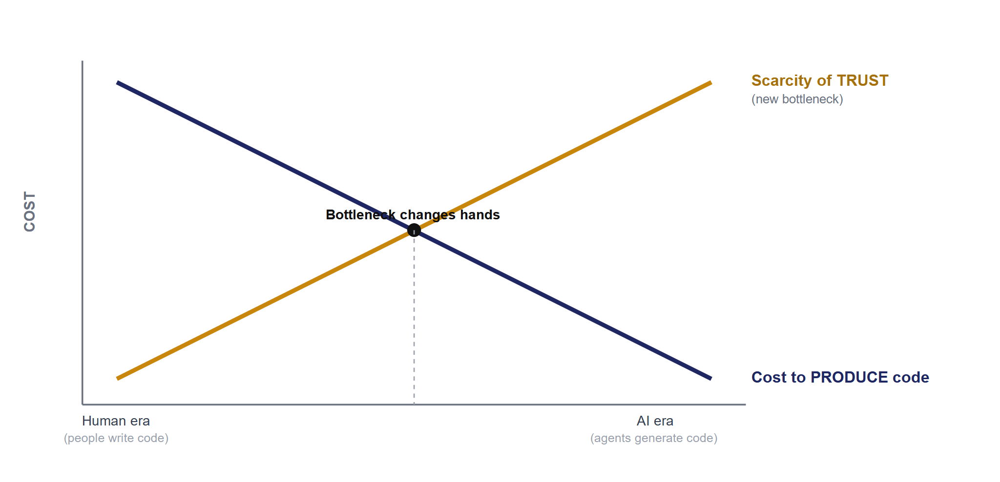

# Code Got Cheap. Trust Didn't.

### The Synchronization Trap: software's unnamed gap in the AI era — and the verification discipline that closes it

---

## TL;DR

The press sells us a story in which AI "thinks like us" and is "about to replace programmers." But if you look at where the cost of software has actually moved, a different truth appears: **AI made *producing* code nearly free, but it did nothing to make *trusting* code cheaper.** The industry's bottleneck has quietly shifted from *writing code* to *knowing whether the code is right* — the part a language model, on its own, cannot close.

This essay argues four things:

1. **The booming "friction jobs" — prompt engineering, context engineering, agent harnessing, evals — are not inevitable rungs on an evolutionary ladder. They are *scar tissue* growing around an un-bridged interface.** The evidence is in their *instability*: a real abstraction crystallizes and compounds; these keep getting renamed and rebuilt every 12–18 months.
2. **This gap is *central*, not peripheral** — and it is measurable. The paradox: it is *worst* exactly where software is most valuable — mature, brownfield projects run by experts.
3. **Left unclosed, the gap opens into a two-horned trap — "the Synchronization Trap."** Either you keep your intent and lose control of the system (an *operational* stall), or you keep the system AI-legible by *shrinking your own intent* (a *creative* stall). Both are two faces of the same rising synchronization cost.
4. **The way out isn't better prompts, but a discipline — *verification independence*** — and a new *role*: a bridge engineer between human and AI. This is what *dissolves the fork*, so you don't have to sacrifice either the system or your ambition.

---

## I. The gap hidden behind a wrong metaphor

The reigning metaphor is **similarity**: AI is "smart," it "understands," it "thinks" — implying it is just *another programmer*, only faster. The metaphor is convenient for marketing but wrong on the engineering, and that error costs real money.

Replace the metaphor with a measurement. For half a century, the cost of a line of software has had two parts: the cost of *production* (deciding on and typing out the code) and the cost of *verification* (knowing it does the right thing). Throughout the human era, production was the expensive part — so every tool, language, and paradigm (procedural → object-oriented → functional) was optimized to *organize production*.

AI just collapsed one of those two pillars. Generating code trends toward zero. But **verification did not** — and here is the crux: verification does *not* get cheaper, because the cheapest "oracle" you have (the very model that produced the code) is *correlated with its own errors*. When one cost pillar collapses and the other does not, **the bottleneck shifts to the pillar still standing.** Today's software bottleneck is no longer "write faster" — it is "trust it without re-reading all of it yourself."

That is the unnamed gap. The rest of this essay names it, proves it is real and measurable, shows what trap it opens into, and proposes a structure to close it.

---

## II. Friction isn't a ladder: reading the "new jobs" as symptoms

A *successful* technical abstraction has a tell: **it stabilizes and compounds.** The function, the compiler, TCP/IP, the relational model — they arrived and *stayed*, and everything built on top of them endured. When a layer has to keep being renamed and rebuilt, that is not progress accelerating; it is a sign the layer is *covering an unhealed crack*.

Examine the AI era's "friction jobs" by that test:

| Friction (symptom) | Which gap it patches (the disease) |
|---|---|
| **Prompt → context engineering** (renamed in < 2 years) | A leaky *input* interface: human intent → model behavior is lossy |
| **Agent harnessing** (AutoGPT → a forest of frameworks) | The loop *won't close on its own*: the core needs heavy scaffolding to finish a task |
| **"Evals are the new unit tests"** | *Can't tell right from wrong*: the old oracle problem resurfacing in new clothes |
| **Model Context Protocol** (had to become a protocol) | *Bridging context* turned out to require infrastructure — proof it is non-trivial |
| **`llms.txt`, `AGENTS.md`, `.cursorrules`** | Humans *actively remodeling the repo so machines can read it* — the leading edge of a trap (see §V) |

"Prompt engineering" was crowned the job of the future in 2023; less than two years later, the industry's most influential voices (Karpathy, Lütke) publicly replaced it with "context engineering." A job that renames itself after 18 months is not a crystallizing abstraction — it is a *patch* over a leaky interface.

Read one at a time, each looks like a step forward. Read together, they are **scar tissue around the same wound**: the interface between *human capability/intent* and *machine output* has not been bridged in a structured way. We are patching symptoms without naming the disease.

> **Corollary:** don't reflexively crown these frictions "the skills of the future." Ask instead: *what gap is this patching?* The answer almost always reduces to one place: we trust the machine to *produce*, but we have no structure to trust its *product*.

---

## III. Why the gap is central, not peripheral

Three foundational results in computer science — all *predating* AI — explain why this gap cannot be "intelligence'd" away.

**1. Brooks — essence vs. accident (1986).** Fred Brooks split software complexity in two: the *accidental* (the toil of expressing a solution — syntax, boilerplate, typing) and the *essential* (the difficulty of *deciding what the right solution is*). No "silver bullet" attacks the essential part. **AI is a spectacular assault on the *accidental*** — it types the code for us. But the *essential* part — specifying what is correct and verifying you achieved it — AI cannot carry. When the accidental collapses toward zero, **the entire cost lands on the essential part** that Brooks said is irreducible.

**2. Naur — a program is a *theory* (1985).** Peter Naur argued that a program is not its source text; it is a *theory living in the minds* of the people who built it — about how the world maps into the code, why each decision exists. Code is merely a *projection* of that theory. When the theory is lost (the team leaves), the program "dies." **The chilling corollary:** when a machine writes code that *no human holds the corresponding theory for*, you get a projection **with no theory behind it** — legacy code *the moment it is born*. Michael Feathers defined legacy as "code without tests"; the AI era needs a sharper definition: **legacy is code with no theory in any human's head.**

**3. The oracle problem (Weyuker, 1982).** To know a program runs *correctly*, you need an independent source telling you what the correct output should be — an "oracle." AI makes this problem *worse*, not better: the *cheapest* oracle is now the very model that produced the code — and a test written by the same (primed) author *replicates the code's own wrong assumptions*. A tautology trap, at industrial scale.

Put together: AI moves cost back to where it was always hardest (Brooks), produces code without theory (Naur), and erodes the independent oracle (Weyuker). The verification gap is **not a side effect** of the AI era. It *is* the main axis.

---

## IV. The measurable gap — and the brownfield paradox

This is not philosophical speculation; it leaves tracks in the data, and those tracks point in one consistent direction: **AI raises *output* but erodes *reliability* — worst where value is highest.**

| Source (accessible today) | Finding | What it proves |
|---|---|---|
| **METR (2025), RCT** | Experienced devs on *their own* repos were **~19% slower** with AI; yet *believed* they were +20–24% faster | The "similarity illusion" *measured* — cost hidden by the feeling of speed |
| **GitClear (2024–25)** | Churn up, duplication/copy-paste up, *refactoring down* | More code, *less cohesion*; behavior already bending to the tool |
| **DORA / Google (2024)** | AI adoption associated with *declining delivery stability* | More change, a *less stable* system |
| **Stack Overflow (2024)** | Most *use* AI, but *trust* in its accuracy is low | Used but not trusted = the very definition of an unsolved gap |
| **The "70% problem" (Osmani, 2024)** | AI gets you to 70% fast; the last 30% (integration, debugging, *understanding*) is where it stalls | That 30% *is* the verification 30% |

The pattern is strikingly consistent, and it produces the **brownfield paradox**: AI is fastest on greenfield (new, throwaway code) and **slowest / riskiest on brownfield** (mature systems, many implicit constraints, high *essential* complexity). But most of the world's *economically valuable* software **is brownfield**. Hence a dangerous scissor: brownfield is pressured to compete with the speed of AI-integrated greenfield, so it is forced to embed AI into its process — *precisely where naive AI adoption backfires hardest*. The pressure is real and legitimate; it is the "embed AI then vibe" answer that pours fuel on the fire.

---

## V. The Synchronization Trap: two horns of one bull

This is the heart of it. When AI produces faster than humans comprehend, **the cost of keeping *intent* (what the human wants) synchronized with *reality* (what the machine wrote) rises super-linearly.** A team *without a bridge discipline* is eventually forced onto one of two horns — and **both are failures.**

### Horn A — the operational stall *(a pain point already measured)*

The team keeps its intent/ambition, but the *system* outgrows every human's theory. Velocity reverses — not in a sudden crash, but as a creeping sense that "everything is hard to change lately." This is *not prophecy*: it is the **extrapolation of already-measured micro-signals** (METR −19%, DORA stability down, GitClear churn up) into a macro-event. The scenario: dashboards *look* healthy (commit volume high) while "time-to-understand-before-changing" and incident rates quietly rise — until a production incident *no one on the team can explain under pressure*, because the component was machine-written and no one holds its theory. The team realizes it **owns a system with no subject.**

### Horn B — the creative stall, or "Seeing Like an AI" *(a hidden pain point, more dangerous)*

To keep the system *legible to the AI*, humans do the opposite: **they shrink their intent down to exactly what the AI can grasp.** The direction of deference *inverts* — at first AI accommodates the human (vibe-coding lets you express loose intent and AI fills the gaps), but later **the human accommodates the AI**: choosing architectures the AI navigates easily, writing over-explicitly, *no longer attempting* designs where "making the AI understand would be too expensive or impossible." The tool sold as "expanding the possible" turns out to **shrink** it. *(The technical mechanism behind it — "pattern retrieval" — is dissected in §VI.)*

There is a precise framework for this. In *Seeing Like a State* (1998), James C. Scott describes how the state reshapes reality to be *legible to itself* — monoculture forests, grid streets, standardized surnames — and in doing so **destroys "metis,"** the local, tacit knowledge that doesn't fit the template. **Horn B is "Seeing Like an AI":** the programmer reshapes the design for *model legibility*, and sacrifices exactly the tacit/creative part that doesn't fit the template.

Why is Horn B *more dangerous* than Horn A? Because it is a **counterfactual** loss: you never see the design you *didn't dare* attempt. Horn A at least produces a pointable incident; Horn B produces a **silent contraction of ambition**, disguised as "pragmatism." Put differently: **Horn B is METR's "perception gap" applied to *creativity* instead of *velocity*** — the cost is hidden, so the crisis arrives quietly and is mistaken for maturity.

**Honest about the evidence:** Horn A has *hard data*; Horn B is a **structural extrapolation from early indicators** — labeled clearly so you don't confuse the two. But the early indicators *accessible right now* are already persuasive:

- **`llms.txt`, `AGENTS.md`/`CLAUDE.md`, `.cursorrules`:** the appearance of a whole class of files whose purpose is to *remodel the repository for machine legibility* — humans **actively stepping into Horn B**, observable today.
- **GitClear:** *less refactoring, more duplication* is not just falling quality — it is **behavior bending to the tool** (giving up the kind of subtle refactor AI does poorly; accepting the duplication AI does fine).
- **Regression to the mean:** LLM assistance pulls code toward the training distribution — more conventional, less novel; a proxy for shrinking diversity.

### The fork is lose–lose — and the bridge discipline *dissolves* it

| | **Horn A — operational stall** | **Horn B — creative stall** |
|---|---|---|
| Sacrifices | Control of the *artifact* | Your own *intent* |
| Keeps | Ambition (loses the system) | The system (loses ambition) |
| Manifests as | Incidents, maintenance collapse | "Going pragmatic," abandoning hard ideas |
| Visible? | Yes | **No (counterfactual)** |
| Evidence | Hard data (METR/DORA/GitClear) | Early indicators (AGENTS.md, refactor ↓) |

The key point: the bridge discipline is **not choosing the less painful horn** — it **keeps the synchronization cost bounded**, so you do *not* have to sacrifice either the system or your intent. The rest of the essay is what that discipline is.

---

## VI. The root error: treating human and AI as interchangeable

Every operational mistake above reduces to one conceptual mistake: **treating human and AI as two versions of the same thing.** This is where the "similarity" metaphor does the most damage. The *engineering-relevant* truth is not that they are alike, but that they **differ in complementary ways**:

| | Human | Code-generating AI |
|---|---|---|
| Holds the **theory** (Naur) | Yes — but expensive, slow | No — produces only the projection |
| Production speed | Slow, effortful | Nearly instant |
| **Independence** when self-checking | Can be deliberately blinded | *No* — the test it writes correlates with its own errors |
| Disposition | Skeptical; knows "what it doesn't know" | *Self-affirming*, fluent, confident even when wrong |

Read the table and one thing emerges: human and AI are not *substitute rivals* but **two halves of a complementary pair** — one produces at unprecedented speed, the other holds theory and *can be blinded for independent verification*. The fatal error is using one side for both jobs: letting AI both write code and certify its own code. That is handing the defendant the judge's bench.

**The mechanism of the difference — "pattern retrieval."** The divergence between the two minds is not vague; it has a nameable mechanism, *distinct* from hallucination. When you hand an AI a specific artifact, what it usually does is not analyze that artifact, but **map your context onto the nearest shape in its training distribution and answer from that *template* — not from your specific content.** The answer is "technically correct for a generic system" but has *never touched* your system. This is the root of three seemingly separate things:

- **Why the oracle correlates with the error (§III):** the cheapest "oracle" — the model itself — judges from the very prior that generated the code. Defendant and judge *share one memory*.
- **Why Horn B has a mechanism, not just a metaphor (§V):** "Seeing Like an AI" *is* pattern retrieval seen from the human side — when you remodel a design to be "machine-legible," you are **pulling your artifact toward the model's training distribution.** Horn B = the system drifting toward the machine's prior.
- **Why "wait for a bigger model" won't save you:** pattern retrieval doesn't vanish with bigger models or better prompts, because **the training distribution doesn't tell the model which structural elements are missing from *your* specific problem.** It is a *structural* deficiency, not a *capacity* one — so it can't be intelligence'd away.

This mechanism turns "synchronize the two minds" from a metaphor into a **concrete engineering problem**: how to force the AI off its training template and onto the artifact in front of it — and how to *know* when it hasn't. The entire skill set in §VIII orbits these two questions.

**The press is wrong to call them *similar*. The engineering is right to call them *complementary* — and the complementarity only pays off when we keep the two mental models *structured into synchrony*, instead of blended.** That structured synchrony is exactly what the Synchronization Trap attacks, and what the discipline below protects.

---

## VII. The structural solution: the discipline of verification independence

If the disease is "we trust production but have no structure to trust the product," the cure is not a cleverer prompt (another input patch). The cure is a *discipline*: shift the **core unit of engineering** from the *function/class/test-case* to the **falsifiable equivalence claim** — an assertion of correctness that an *independent, blinded* party can try to *break*.

Six invariant principles (lifted out of any specific project, so each team can substitute its own example):

1. **The source-of-truth is the *object of study*, not something the code must obey.** In AI-in-the-loop systems, "what is correct" must often be *discovered*, not assumed up front.
2. **Triangulate across ≥ 3 independent representations.** "Correct" = multiple *independently derived* representations converging (spec ↔ implementation ↔ a third oracle), instead of a two-way code-passes-test comparison.
3. **Independence / blinding is *load-bearing*.** The party writing the verification *must not see the answer*, must derive from semantics, and must treat the producer's output as *a prediction to falsify*. This is exactly where Weyuker's oracle/tautology trap is defeated.
4. **A falsification stance.** The goal is to *break*, not to *confirm*. A "pass" is provisional until reproduced by another independent party.
5. **Separate *probe* from *verdict*.** A measurement script (written by the producer to *observe*) and a verification test (written by an independent party to *judge*) are two different artifacts, by two different parties. Blending them is how tautology sneaks in.
6. **An "assumed-vs-actual" voice.** Any "green" state reached *via an assumption* must be shown as a **hypothesis**, never presented as proven fact.

**Why this is feasible only *now* — and why it is genuinely new.** Every idea above is *old*: N-version programming (Avižienis, 1985), metamorphic testing (T.Y. Chen, 1998), independent replication in science, formal methods. In the human era, "independence" was *enormously expensive* — to get an independent verifier you had to hire a second team; so independence was a luxury only aerospace could afford. **The economic flip of the agent era: for the first time, "independence" is *cheap*.** You can spin up a fresh agent, *control exactly what it knows* (blind it at will), and have it try to break another agent's output — at near-zero cost. The era's real contribution is *not* a new technique; it is **turning verification independence from a luxury into a default primitive** of the process. A name worth spreading: *verification independence as a default primitive.*

### Four honest boundaries (lest this essay fall into the overclaim it criticizes)

- **"Who verifies the verifier?"** Independence is about **decorrelating errors**, not infinite certainty. It *lowers* the probability of shared blindness, it doesn't *erase* it.
- **The "false independence" trap.** If the verifying agent shares a *base model* with the generating agent, their errors correlate → the independence is merely formal. True independence often requires **model diversity** (N-version with different models) — which *complicates* the "independence is cheap" claim, and must be said plainly.
- **The economics can flip a second time.** Spinning up blinded agents is "cheap" but not free; at scale, verification compute can rival production compute.
- **When the discipline is *overkill*.** Imposing the top tier on a two-week prototype kills the very speed advantage. Most CRUD has a cheap oracle and needs only the low tier. Hence a *ladder*, not a mandate.

### A maturity ladder — so each team enters at its own rung

| Rung | Adds | For |
|---|---|---|
| **L0** | Self-written tests, same author | *Most projects today* |
| **L1** | + Separate probe ≠ verdict | Measurement split from judgment |
| **L2** | + Assumed-vs-actual voice | End the "it's done" overclaim |
| **L3** | + An *independent* agent rewrites the pivotal verification | Blinded replication for high-risk parts |
| **L4** | + Triangulate ≥ 3 representations (model diversity) | Only the genuine "oracle problem" cases |

Only the *hard-oracle* systems — ML kernels, distributed systems, finance, safety-critical, and **brownfields with complex implicit behavior** — need to climb high. *(This principle set was distilled from a real brownfield case: a stochastic ML kernel where the "correct output" is itself uncertain — exactly the hardest class, where every verification shortcut is exposed.)*

---

## VIII. The missing profession: the human–AI bridge engineer

Every platform shift births a role that wasn't needed before: the DBA when data became an asset; **the SRE when operations crystallized into its own discipline at Google** (a *real* precedent: a role born from a *cost shift*); application security when the attack surface exploded. The AI era is demanding a role too — but **not the prompt/context engineer.**

To be clear, because the industry is conflating these:

| | Owns which interface | Nature | Fate |
|---|---|---|---|
| **Prompt/Context Engineer** | *Input*: intent → model | Optimizes what we *put in* | Friction — will keep being renamed |
| **Traditional QA / Test** | *Output* vs. a fixed spec | Confirms against pre-written expectations | Necessary, but assumes an oracle exists |
| **Human–AI Bridge Engineer** | *Output → grounded trust*; and the *theory* | Architects & judges independence | A discipline — it will stay |

Call it the **human–AI bridge engineer** (or, more tersely, *verification engineer*). It is *not* a tool but a *role* — because what it does is fundamentally *architecture and judgment*, which can't be packaged into a plugin. Its core mandate:

1. **Hold the theory (Naur)** — ensure *a human* always holds the system's theory, even when every projection (the code) is machine-written. This is the line of defense against "legacy at birth" *and* against Horn A.
2. **Architect the *verification topology*** — decide what is the oracle, which representation is independent of which, what each agent is allowed to know (blinding), which is the pivotal equivalence claim to be broken.
3. **Synchronize the two mental models** — translate between *the theory a human holds* and *the projection a machine generates*, keeping them aligned rather than drifting. This is exactly what *keeps the synchronization cost bounded* — i.e., **dissolves the fork** of §V, defending against *both* horns at once.
4. **Defend independence as an asset** — treat "who knows what" (priming) as a first-class engineering variable, because that is what decides whether a verification is *valuable* or merely tautology burning electricity.

Tersely: a prompt engineer makes the AI *say* what we want; **the bridge engineer makes us able to *trust* what the AI produces — and keeps our intent from shrinking to fit the machine.** One is friction that will dissolve; the other is a discipline that will stay.

### The skill set — and the evidence it has already begun forming

The role sounds abstract, but *its first toolkit has already appeared in practice* — the strongest signal that this is a real profession, not just an idea. Four core competencies, and notably **all four reduce to the same thing: countering pattern retrieval and protecting independence** — i.e., the six §VII primitives sharpened into daily operations:

*(Deliberate altitude: below I name the **competency** — what the role achieves — and **point** to practitioner frameworks that already exist, to show the toolkit is real; their detailed operating mechanics are out of scope for a framing essay.)*

1. **Detecting and breaking pattern retrieval.** Recognizing the *moment* an AI switches from analyzing the artifact to answering from its training template, and pulling it back onto the evidence — rather than accepting an answer that is "correct for a generic system." *(Practitioner framework named S-Prompting / POLA already exists — see References.)*
2. **Building theory where none exists (zero-prior theory-building).** Extracting the system's theory *from the artifact itself* by systematic method, instead of needing to be the original author or a domain expert — the skill that makes the role *scalable* (you don't need to have *written* a brownfield to bridge it). The direct antipode of pattern retrieval: forcing the truth to *emerge from the artifact*, not from a prior.
3. **Freezing knowledge into executable artifacts.** Replacing natural-language summaries — eroded by pattern retrieval session over session — with *artifacts anchored on the system's actual behavior*, so knowledge doesn't drift between sessions. *(Practitioner framework named HDVO already exists — see References.)*
4. **Engineered blinding.** Designing feedback channels that *signal the failure type without revealing the answer* — operationalizing the "a probe exposes only observable state, never the answer key" primitive. *(A concrete technique for this already exists in practice — see References.)*

So this profession is not "knowing more frameworks." It is **the discipline of keeping human and machine from drifting apart at the level of each interaction** — and its skill set is measurable, teachable, and hireable.

---

## IX. External linkages & broader forecast

This gap does not stop at the engineering room. Four fronts are heating up:

- **Liability & regulation.** With the EU AI Act (2024) and software-liability directives, when machine-written code causes harm, *who is responsible* becomes a legal question. The "verification topology" becomes an **audit/compliance artifact** — evidence that a human held the theory and an independent structure rendered judgment.
- **Open source is drowning.** Maintainers, already overloaded, are now flooded with **AI-generated PRs and "security reports" that carry no theory**. Daniel Stenberg (curl) publicly called these "AI slop" and in 2025 began rejecting AI reports — *external, ongoing evidence* of "projection without theory" at community scale.
- **Supply-chain security.** "Slopsquatting" (2025) — AI *hallucinates* a package name, an attacker registers exactly that name with malware — is a *structurally new* class of vulnerability, born directly from trusting machine output with no independent verification layer.
- **Misaligned education & hiring.** If the unit of engineering shifts away from "writing code," then CS curricula and interviews (still testing code-writing) are measuring the wrong thing — and will have to measure *the ability to architect verification and hold theory* instead.

**An adoption-trigger theory: why the market won't self-correct (soon).** There is an uncomfortable consequence of the cost being *hidden*: it predicts that adoption of this discipline will *not* be driven by efficiency arguments — because the very perception gap (METR) suppresses the efficiency signal. The forcing functions are more likely the mechanisms that **internalize the cost externally**, from fast to slow: *regulation & liability* (turning the "verification topology" into a mandated line item); *insurance and enterprise procurement* (demanding independent-verification evidence the way they came to demand SOC2/SBOM — via contracts, faster than law); and finally *a symbolic incident + craft diffusion*. The consequence: adoption will be **asymmetric** — regulated, high-blast-radius sectors (finance, medicine, infrastructure) go first via mandate; the long tail follows late. This leaves open a question that **the community — not any individual — must answer:** can comprehension cost be turned into a *real-time, legible metric*? If yes, the efficiency path becomes viable; if not, we depend on mandate. *(I state this as a calibrated claim, not a certainty — the structure is firm, the timing is open.)*

**If left unaddressed:** comprehension debt compounds silently; brownfield erodes; new attack surfaces open; a generation of systems *no subject understands* accumulates toward a breaking point — and because the cost is hidden by the *feeling of speed*, the crisis arrives **quietly**, showing up only as "somehow everything is hard to maintain / hard to create lately." **If closed structurally:** AI's production speed + a human-architected verification-independence discipline = **real compounding** — fast *and* trustworthy, *and* without shrinking ambition.

**Why now:** the norms of this era are *being cast* over the next 1–2 years. Once "prompt it well and merge" hardens into the default culture, undoing it will be as expensive as any cultural debt. The window to install *verification independence* as a **default primitive** — rather than an afterthought — is right now.

> **A falsification commitment (so this thesis is *testable*, not just agreeable).** *Prediction:* by the end of **2027**, teams that adopted heavy AI-assisted coding on mature (>3yr) codebases *without* an independent-verification discipline will show — relative to comparable disciplined teams — (i) rising *time-to-change* and (ii) rising *change-failure/incident* rates, **even as commit volume holds or rises**. *If instead* those metrics stay flat or improve over 2025–2027, **the Horn-A thesis is wrong.** Two honest caveats: (a) *confound* — stronger 2027 models could mask the effect; (b) *the measurement paradox* — the very hidden-ness that makes the problem important also makes it hard to measure and thus hard to falsify. Stating both plainly is part of the honesty, not an escape hatch.

---

## X. The strongest objection: "Verification will get cheap too"?

The most dangerous objection to this essay is the *load-bearing* one: *"Just like production, verification will get cheap — models will self-critique, AI-verifies-AI with model diversity, formal-methods + AI, ever-better evals — and the gap closes on its own."* It must be met head-on.

**What must be conceded (and is, genuinely):** yes, verification *tooling* will get cheaper and better — automated test generation, stronger evals, AI-assisted formal proof, multi-model cross-checks. A large share of verification work *will* be automated.

**Where there is a *floor* that compute does not lower:** the hard core of verification is the **oracle problem + independence**.

- *Oracle:* for a **novel intent**, no oracle exists ready-made — *someone* must decide what "correct" means. That is a human act of theory (Naur/Brooks), not a capacity problem. AI cheapens *checking against* an oracle, not *being* the oracle for genuinely new intent.
- *Independence:* AI-verifies-AI helps *only to the degree the verifier's errors decorrelate from the generator's*. But foundation models are **converging** (shared data, shared architectures, distillation) ⇒ diversity — the sole source of decorrelation — is *shrinking* over time, a trend that runs *against* the optimist. True independence ultimately anchors in something *outside the model distribution*: real execution behavior, formal proof, or a human's theory.

**The surprise — this objection *sharpens* the thesis rather than killing it.** Granting all of the above, the verification gap *narrows* to exactly where it was always most acute: the **hard-oracle + hard-independence** region (precisely the ladder's structure — CRUD has a cheap oracle at L0–L2; only the hard cases climb to L4). In other words, this is **Brooks applied to verification itself:** the silver bullet lowers the *accidental* cost of verification, not the *essential* one.

**What stays honestly open:** the *size* of the residual hard-oracle region — versus the share that gets automated away — I do not claim to know, and it hinges on two variables the community must watch: progress in formal methods, and whether **model diversity** is *deliberately preserved* or eroded by the market. Posing that question at the right time matters more than one person pretending to have settled the answer.

---

## XI. Conclusion

To be blunt, so this essay doesn't fall into the overclaim trap it criticizes: **this is not a silver bullet.** Brooks warned in 1986 that there is no silver bullet for essential complexity, and verification *is* essential complexity. The essay promises no erasure of the gap; it proposes **naming it correctly, measuring it correctly, and placing the right discipline + the right role where they are needed most, in time.**

The two stalls — operational and creative — are not two separate risks; they are two horns of *one* Synchronization Trap. And the way out is not to dodge one horn into the other, but to build the bridge that keeps human intent and machine-written reality from drifting apart. In an industry hypnotized by speed, naming the real bottleneck is already half the solution.

And the three hardest questions above — *the adoption trigger*, *the falsification marker*, and *whether verification gets cheap on its own* — this essay does not pretend to have settled. It attempts something humbler but more essential: **to name them correctly, at the right time, so an entire community can interrogate them.** Raising collective awareness of a real problem sometimes matters more than any one individual closing the answer.

> **Code got cheap. Trust didn't. The bridge across that divide — between human and AI — is still waiting to be built.**

---

## References (verify against primary sources before citing)

*This essay deliberately separates "invariant principle" from "specific example"; the sources below are objective anchors — re-check the figures at the primary source before quoting. Claims about Horn B are explicitly labeled as structural extrapolation from early indicators, not hard data.*

- Peter Naur, *Programming as Theory Building* (1985).
- Frederick P. Brooks, *No Silver Bullet: Essence and Accidents of Software Engineering* (1986).
- Elaine J. Weyuker, *On Testing Non-testable Programs* (1982) — the test oracle problem.
- Michael Feathers, *Working Effectively with Legacy Code* (2004).
- James C. Scott, *Seeing Like a State* (1998) — legibility and "metis."
- Algirdas Avižienis, *The N-Version Approach to Fault-Tolerant Software* (1985).
- T. Y. Chen et al., *Metamorphic Testing* (1998 onward).
- Andrej Karpathy, "vibe coding" (X, Feb 2025); "context engineering" discussion (2025).
- METR, *Measuring the Impact of Early-2025 AI on Experienced Open-Source Developer Productivity* (2025).
- GitClear, *AI Copilot Code Quality / Coding on Copilot* (2024–2025).
- Google / DORA, *Accelerate State of DevOps Report* (2024).
- Stack Overflow, *Developer Survey* (2024).
- Addy Osmani, *The 70% Problem: Hard Truths About AI-Assisted Coding* (2024).
- Anthropic, *Model Context Protocol* (Nov 2024); the `AGENTS.md` / `CLAUDE.md` convention; `llms.txt` (Jeremy Howard, 2024); `.cursorrules`.
- Practitioner frameworks on *pattern retrieval* (distinct from hallucination), **S-Prompting** (de-scripting · altitude adjustment · POLA) and **HDVO** (human-in-the-loop, hypothesis-driven validation; "abstract error codes"; behavioral ground truth from execution) — *prior work by this essay's own author*, Medium (@thienan092), 2024–2025. [Cited to preserve the methods' historical provenance, not for promotion.]
- Daniel Stenberg / curl — position on "AI slop" in security reports (2024–2025); community discussion of *slopsquatting* (2025); EU AI Act (2024).
