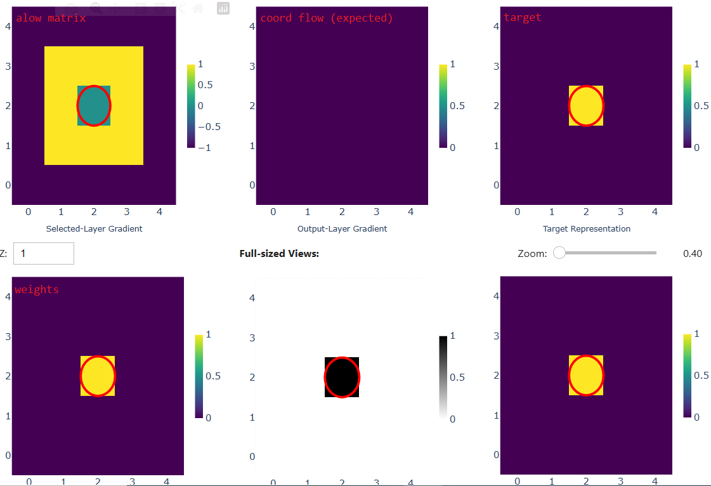

# TOUCHME.md

## Table of Contents

-   [Test Case Overview](#test-case-overview)
    -   [File: `utest_smap.py`](#file-utest_smappy)
        -   [test_prepare_flows_for_coord](#test-case-test_prepare_flows_for_coord)
        -   [test_prepare_flows_for_mask](#test-case-test_prepare_flows_for_mask)
        -   [test_SMap_forward](#test-case-test_smap_forward)
    -   [File: `utest_smap3x3.py`](#file-utest_smap3x3py)
        -   [test_to_3d3x3](#test-case-test_to_3d3x3)
        -   [test_agg_factor_only](#test-case-test_agg_factor_only)
        -   [test_agg_ind](#test-case-test_agg_ind)
    -   [File: `vtest_smap3x3.py`](#file-vtest_smap3x3py)
        -   [test_in_x_1st_stage](#test-case-test_in_x_1st_stage)
        -   [test_in_x_2st_stage](#test-case-test_in_x_2st_stage)
        -   [test_in_y_1st_stage](#test-case-test_in_y_1st_stage)
        -   [test_in_y_2st_stage](#test-case-test_in_y_2st_stage)
        -   [test_in_r_1st_stage](#test-case-test_in_r_1st_stage)
        -   [test_in_r_2st_stage](#test-case-test_in_r_2st_stage)
    -   [Summary](#summary)
-   [Debug Gradients and Create Test Case with vtest Tool](#debug-gradients-and-create-test-case-with-vtest-tool)
    -   [Debugging Gradients](#debugging-gradients)

------------------------------------------------------------------------

# Test Case Overview

The `tests` directory is essential for ensuring the correctness, stability, and reliability of the SMap library. This document describes the meaning, detailed logic, and expected outputs for each test case, with illustrative examples and diagrams to help contributors and users understand the test coverage.

Tests are executed when:

-   CI/CD executed.

To run it manually, use this command:

``` bash
python -m unittest discover -s tests -p "[vu]test*.py"
```

Main test files:

-   `utest_smap.py`: Unit tests for the SMap class.

-   `utest_smap3x3.py`: Unit tests for SMap3x3 and utility functions.

-   `vtest_smap3x3.py`: Integration and gradient tests for SMap3x3 with real data.

------------------------------------------------------------------------

## File: `utest_smap.py`

### Test Case: `test_prepare_flows_for_coord`

**Assure:**\
Blocking gradient flows at the edges of the input image or gradient flow at a point which has its *proper screen position* is an active point on the target image.

**Describe:**\
Verifies that the `prepare_flows_for_coord` method correctly identifies valid and blocked gradient flows based on the "allow matrix" and target.

**Typical Example & Expected Output:**

-   **Scenario:**

    -   Image: 5x5, active pixel at (2,2).
    -   The (only) active point did not move after the forward pass of SMap ("still" case).

-   **Input:**

    -   `weights`: 3x3x7x7 tensor, only `weights[1,1,2,2]=1`
    -   `target`: 5x5, `target[2,2]=1`

-   **Expected:**

    -   For offset matching the active point (offset 4), sum is 0 (blocked).

-   **Illustration:**

    

    ```         
    Input (target):
    [0 0 0 0 0]
    [0 0 0 0 0]
    [0 0 1 0 0]
    [0 0 0 0 0]
    [0 0 0 0 0]

    Weights (offset 1,1):
    [0 0 0 0 0]
    [0 0 0 0 0]
    [0 0 1 0 0]
    [0 0 0 0 0]
    [0 0 0 0 0]

    Output "actual" sum for each offset:
    offset 4 (still): 0
    other offsets: 0
    ```

------------------------------------------------------------------------

### Test Case: `test_prepare_flows_for_mask`

**Assure:**\
Blocking gradient flow at a point which has its *proper screen position* is an active point on the target image.

**Describe:**\
Verifies that the `prepare_flows_for_mask` method correctly identifies valid and blocked gradient flows based on the "allow matrix" and target.

**Typical Example & Expected Output:**

-   **Scenario:**

    -   Image: 5x5, active pixel at (2,2).
    -   The (only) active point did not move after the forward pass of SMap ("still" case).

-   **Input:**

    -   `weights`: 3x3x7x7 tensor, only `weights[1,1,2,2]=1`
    -   `target`: 5x5, `target[2,2]=1`

-   **Expected:**

    -   For offset matching the active point (offset 4), sum is 0 (blocked).

-   **Illustration:**

    

```         
Input (target):
[0 0 0 0 0]
[0 0 0 0 0]
[0 0 1 0 0]
[0 0 0 0 0]
[0 0 0 0 0]

Weights (offset 1,1):
[0 0 0 0 0]
[0 0 0 0 0]
[0 0 1 0 0]
[0 0 0 0 0]
[0 0 0 0 0]

Output "actual" sum for each offset:
offset 4 (still): 0
other offsets: 0
```

------------------------------------------------------------------------

### Test Case: `test_SMap_forward`

**Assure:**\
The forward pass of SMap maps the activated point's position to its *proper screen position* on the *2D representation*.

**Describe:**\
Run "1-stage" SMap explicitly.

------------------------------------------------------------------------

## File: `utest_smap3x3.py`

### Test Case: `test_to_3d3x3`

**Assure:**\
The function `to_3d3x3` correctly converts a depth map to 3D coordinates for a 3x3 neighborhood.

**Describe:**\
Calculate 3D coordinate for 3x3 neighborhood for each point in the depth map using their "common sense" screen position, and expand a new dimension (the third, which has the size `3*3`) to arrange elements of the 3x3 neighborhood on the result matrix at the location of the center point.

**Example & Expected Output:**

-   **Input:**
    -   depth_map: all zeros except `depth_map[2,3]=1000`
    -   offsetx=1, offsety=1
-   **Expected:**
    -   Output is the 3D coordinate for (2,3), calculated as `inv(camera) x [3,2,1].T x 1000`.

**Diagram:**

```         
depth_map:
[0 0 0 ...]
[0 0 0 ...]
[0 0 0 1e3 ...]
[...]

Output "actual":
element @ the position 2,3 of the result:
    actual[batch_id,second_dim_id,0,0,2,3,:] = inv(camera) @ [2,1,1] * 1000
    actual[batch_id,second_dim_id,0,1,2,3,:] = inv(camera) @ [2,2,1] * 1000
    actual[batch_id,second_dim_id,0,2,2,3,:] = inv(camera) @ [2,3,1] * 1000
    actual[batch_id,second_dim_id,1,0,2,3,:] = inv(camera) @ [3,1,1] * 1000
    actual[batch_id,second_dim_id,1,1,2,3,:] = inv(camera) @ [3,2,1] * 1000
    actual[batch_id,second_dim_id,1,2,2,3,:] = inv(camera) @ [3,3,1] * 1000
    actual[batch_id,second_dim_id,2,0,2,3,:] = inv(camera) @ [4,1,1] * 1000
    actual[batch_id,second_dim_id,2,1,2,3,:] = inv(camera) @ [4,2,1] * 1000
    actual[batch_id,second_dim_id,2,2,2,3,:] = inv(camera) @ [4,3,1] * 1000
other: 0
```

------------------------------------------------------------------------

### Test Case: `test_agg_factor_only`

**Assure:**\
Activated points overwrite the default value.

**Describe:**\
Checks aggregation logic using only a factor.

**Example & Expected Output:**

-   **Input:**

    -   `unfolded_depth_map[1,1,2,3]=100`
    -   `factor=999`

-   **Expected Output:**

    -   `expected[1,1,2,3]=100` (after offset adjustment)
    -   All other positions = 999

-   **Illustration:**

    ```         
    Unfolded depth (only one active point):
    offset (1,1) active at (2,3)
    expected[1,1,2,3]=100
    other positions=999
    ```

------------------------------------------------------------------------

### Test Case: `test_agg_ind`

**Assure:**\
Correctly overwritten by active indices.

**Describe:**\
Checks indexed aggregation for multi-channel tensors.

**Example & Expected Output:**

-   **Input:**

    -   `unfolded_depth_map[0,0,:,2,3]=[100,200,300,400]` (vector)
    -   `ind`: one-hot at (2,3)

-   **Expected:**

    -   `expected[:,2,3]=[100,200,300,400]`, other positions = factor.

-   **Illustration:**

    ```         
    Unfolded depth:
    only [0,0,:,2,3] is active (multi-channel)

    ind: one-hot for (2,3)

    expected:
    [:,2,3]=[100,200,300,400], rest=factor
    ```

------------------------------------------------------------------------

## File: `vtest_smap3x3.py`

### Test Case: `test_in_x_1st_stage`

**Assure:**\
Gradients only at valid positions.

**Describe:**\
Tests backward gradient propagation when shifting mask along x direction.

------------------------------------------------------------------------

### Test Case: `test_in_x_2st_stage`

**Assure:**\
Final gradient is at the initial position if the chain of movements is valid.

**Describe:**\
Tests gradients for two-stage shifts along x.

------------------------------------------------------------------------

### Test Case: `test_in_y_1st_stage`

**Assure:**\
Gradients only at valid positions (e.g. moving left/right).

**Describe:**\
Tests backward gradient propagation when shifting mask along y direction.

------------------------------------------------------------------------

### Test Case: `test_in_y_2st_stage`

**Assure:**\
Correct gradient at the initial position.

**Describe:**\
Tests gradients for two-stage shifts along y direction (e.g. left then right).

------------------------------------------------------------------------

### Test Case: `test_in_r_1st_stage`

**Assure:**\
Gradients are only at valid positions, including the "still" (no movement) case.

**Describe:**\
Tests backward gradient propagation for mask (r).

------------------------------------------------------------------------

### Test Case: `test_in_r_2st_stage`

**Assure:**\
Correct gradient at the initial position depending on movement sequence.

**Describe:**\
Tests backward gradient propagation for two-stage mask (r) transformations.

------------------------------------------------------------------------

# Debug Gradients and Create Test Case with vtest Tool

Although, in theory, the optimization process of a single point using SMap permits actions independent of its position on the 2D representation. In practice, the complexity comes from maintaining this optimization behavior across multiple configurations of its 3x3 neighborhoods when more than one active point on the 2D representation is located within that area, or when the single point being optimized is at the edge of the image. The `vtest` tool is developed to help debug and create test cases for these scenarios.

## Debugging Gradients
(Vietnamese)
## I. Quy Trình Sinh Dữ liệu Kiểm thử Gradient (Gold Standard Generation Workflow)

Quy trình này là một chu trình lặp lại, tập trung vào việc tạo ra, thu thập, và sau đó **chỉnh sửa bằng tay** các tensor gradient thô để tạo thành **Dữ liệu Chuẩn (Gold Standard)**.

#### Triết lý Cốt lõi

Triết lý của `vnittest` là chuyển đổi từ kiểm thử dựa trên **giá trị số** sang kiểm thử dựa trên **logic và ngữ nghĩa**, đảm bảo các ràng buộc nghiệp vụ (ví dụ: ràng buộc vị trí trong phép toán Fold/Unfold) được duy trì qua các phiên bản mã nguồn.

#### Bước 1: Chuẩn bị Kịch bản và Hiện thực hóa Unit Test

#### 1.1. Khởi tạo `unittest.TestCase` và Module

* **Mục tiêu:** Thiết lập môi trường và module mục tiêu.
* **Mã nguồn tham khảo (`vtest_smap3x3.py`, `setUp`):**
    ```python
    class SMap3x3VTestCase(unittest.TestCase):
        def setUp(self):
            # ... Tải Input cố định, Khởi tạo Module SMap ...
            # ... Đảm bảo thư mục output tồn tại ...
    ```

#### 1.2. Chuẩn bị Tensor Đầu vào

* **Mục tiêu:** Tạo tensor đầu vào và đầu ra, kích hoạt cờ `requires_grad=True`.

#### Bước 2: Định nghĩa `TestCase` và Gắn `TestBot` (Cấy Sensor)

* **Mục tiêu:** Cấy các **`TestBot`** (`TestBot_In`, `TestBot_Out`) vào module mục tiêu. `TestBot` hoạt động như **Backward Hooks** của PyTorch để chặn và thu thập gradient trong quá trình lan truyền ngược.
* **Mã nguồn tham khảo (Tích hợp `vtest_smap3x3.py` & `vtest_types.py`):**
    ```python
    # Bọc Module
    smap_with_bot = TestBot_In(module=self.smap.map, offset_in=offset_in, name="in", connet2name="out")
    # Khởi tạo và Liên kết TestCase
    test_case = TestCase(name=testcase_name, testbot_in=smap_with_bot)
    ```

#### Bước 3: Thực thi Lan truyền (Forward & Backward)

* **Mục tiêu:** Kích hoạt quá trình tính toán để `TestBot` lưu trữ dữ liệu gradient thô (Raw Gradient Data).
    ```python
    output = test_case.get_testbot_in()(input_) 
    loss = torch.mean(output * target_grad_out)
    loss.backward() # Kích hoạt Backward Hooks -> Dữ liệu gradient THÔ được lưu trữ
    ```

#### Bước 4: Chỉnh sửa và Thẩm định Ngữ nghĩa Trực quan

* **Mục tiêu:** Sửa đổi các tensor gradient thô để chúng thỏa mãn các **ràng buộc ngữ nghĩa trực quan (Visual Semantic Constraints)**.
* **Công cụ:** Sử dụng **`vnittest tool`** để trực quan hóa các lát cắt kernel và chỉnh sửa giá trị.
    

#### Bước 5: Lặp lại và Hoàn thiện Độ phủ (Coverage)

* **Mục tiêu:** Hoàn thiện bộ dữ liệu chuẩn bằng cách lặp lại quy trình cho các trường hợp biên, đảm bảo sự bao phủ toàn diện của các điều kiện kiểm thử.

#### Bước 6: Hỗ trợ Ngữ nghĩa Kịch bản bằng AI

* **Mục tiêu:** Sử dụng [**Kiến trúc HDVO**](../tools/hdvo/README.txt) để kiểm tra chéo (cross-validate) sự **nhất quán logic** giữa *Gradient Chuẩn* và *Giả thiết Ngữ nghĩa* đã được mã hóa.

------------------------------------------------------------------------
