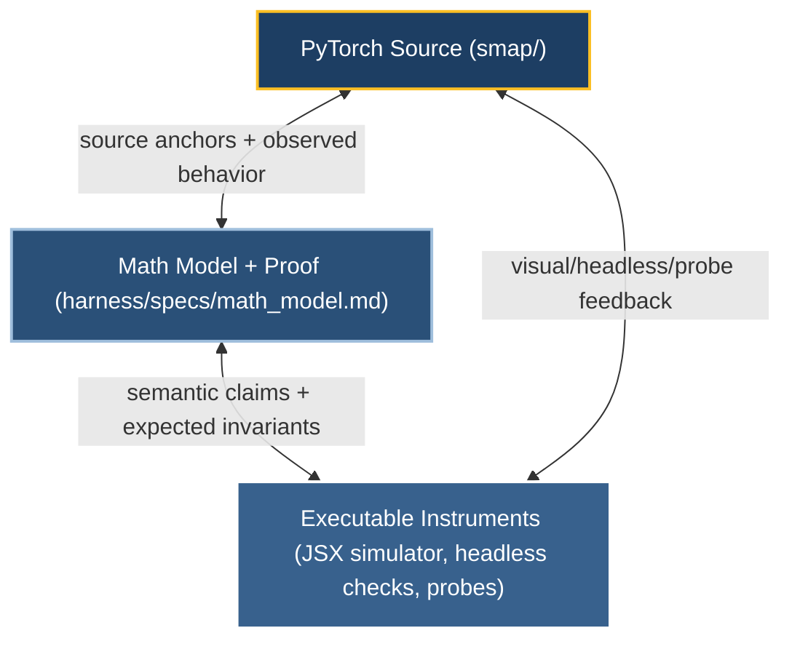

# SMap Verification Harness

The SMap harness is the project's verification layer. It keeps the PyTorch source, the mathematical model/proof, and executable simulators/probes in sync so contributors can isolate whether a discrepancy is a source bug, a proof/model gap, or a simulator/UI mismatch.

## Core idea: tri-anchored verification

SMap uses a tri-anchored workflow: each important mechanism should be understandable from the source, stated in the math model, and observable in an executable instrument.



At mechanism level, the stricter form of this contract is:

```text
app-observable behavior ≡ source behavior under an equivalent test ≡ math-model claim
```

The load-bearing precision is usually **sign and zero/non-zero**, not raw floating-point magnitude.

## Directory map

| Path | Role |
|---|---|
| [`specs/math_model.md`](specs/math_model.md) | Authoritative mathematical model and correctness proof kept close to the current source. |
| [`specs/mechanism_specs.md`](specs/mechanism_specs.md) | Tri-anchored mechanism catalogue: app scenario, independent source test, and math claim. |
| [`simulator/`](simulator/) | JSX simulator plus headless repro checks that mirror key source mechanisms. |
| [`preview/`](preview/) | Small Vite app used to run the JSX simulator locally. |
| [`audit/`](audit/) | Audit sandbox builder, probes, and HDVO data-generation tools. |
| [`context/effective-verbal-context.md`](context/effective-verbal-context.md) | Current operational handoff for AI agents and maintainers. |
| [`context/verification-playbook-VI.md`](context/verification-playbook-VI.md) | General verification methodology and triangulation playbook. |

## Common workflows

### Run the visual simulator

```bash
cd harness/preview
npm install      # first time only
npm run dev      # serves http://127.0.0.1:5188
```

Open <http://127.0.0.1:5188>, reproduce the behavior you want to inspect, then use the simulator's snapshot control when filing a bug report.

### Run the headless simulator check

```bash
node harness/simulator/_repro_check.mjs
```

Use this after changing simulator logic that should remain aligned with the source-facing mechanism model.

### Rebuild the audit sandbox

```bash
python harness/audit/setup_sandbox.py
```

The audit sandbox is ephemeral. Rebuild it before each audit so probes run against a fresh copy of the canonical source with audit instrumentation enabled.

## Guardrails

- Treat `smap/` as the single source of truth for implementation behavior.
- Treat simulator output as evidence, not as the source oracle.
- Confirm bugs from source behavior before adding bug toggles or proof changes.
- Keep source, math model, and simulator claims aligned; if one changes, check the other two.
- Do not edit `harness/audit/sandbox/` as if it were canonical source.
- Re-check revision-sensitive line numbers after edits.
- Distinguish **faithfulness** (the instrument mirrors source behavior) from **correctness** (the behavior satisfies the intended model).

## For AI agents

When resuming project work, load [`context/effective-verbal-context.md`](context/effective-verbal-context.md) or use the `read-effective-verbal-context` skill if it is available in your environment. That handoff records the current phase, active constraints, known bugs, and next-action guidance.
