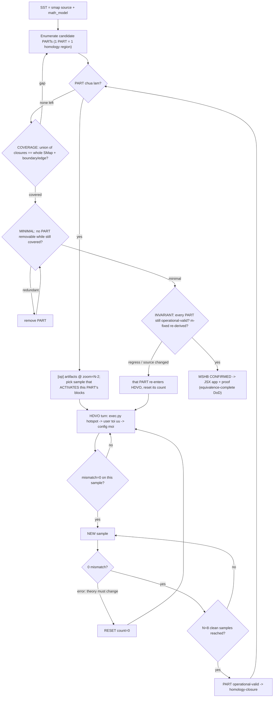

# Effective Verbal Context — SMap: Source-Completion via App-Based Auditing

Self-contained handoff for a **fresh session (Codex / Claude)**. The meta-task is an **iterative loop that
makes the SMap source algorithm *correct*** by auditing it through a React app (`smap_simulator.jsx`)
against a maintained correct-algorithm spec+proof (`math_model.md`). No prior chat is needed — re-open the
artifacts below and rebuild detail from the anchors. **Line numbers are from the current revision and MUST
be re-checked after any edit** (grep before relying)

> **★ RESUME HERE — current state & next action (Latest update; for a fresh session).** Active arc =
> **Improvisational Work / Next Phase (The SMap Evidence Standard is Fully Operational)**. 
> We have **COMPLETED** the validation of the Two-Phase Model and the Local PR Simulation system. 
> **Key Architectural Rules (SMap Evidence Standard) in effect**:
> 1. **7-Type PR System:** Defined in `CONTRIBUTING.md` (Report Bug, Fix Code, Fix Math, Enhance JSX UI, Improve Harness, Run Audit Round, Propose New Application). `CODEOWNERS` locks the `/harness/` from non-Admins. (Was mislabeled "5-Tier"; README likewise said "5 types" — both reconciled to CONTRIBUTING's 7 on 2026-06-12.)
> 2. **Bug Tracking Decoupled:** The Bug Catalogue is in `active_bugs.md` at the root.
> 3. **GitHub-Native Enforcement:** `.github/PULL_REQUEST_TEMPLATE.md` and `.github/ISSUE_TEMPLATE/bug_report.md`.
> 4. **Local PR Simulation:** Any AI Agent contributing *must* create a `PRs/<PR_ID>/` folder.
> 5. **Evidence Standard:** PRs must include **(a) Bug Classification**, **(b) Snapshot-First**, and **(c) POLA Violation Analysis** (required for App/UX bugs, NA for pure Math Bugs).
> 6. **Anti-Hallucination Guardrail:** Agents must prove their fix strictly from the source and `math_model.md`.
> **RECENT ACCOMPLISHMENTS:** A fresh AI Agent successfully submitted a simulated PR for **Bug D** (z-buffer mask-fallback no-op). An Admin subagent subsequently reviewed and merged it, filing the bug in `active_bugs.md`, applying the Type 3 fix to `math_model.md` (demoting Lemma 3), and updating `smap_simulator.jsx` with a `bugDFixed` toggle.
> **IMMEDIATE NEXT ACTION:** The user is proceeding with improvisational work in a fresh session. You are standing by to assist with whatever direction they choose next (e.g., source-fix phase, or exploring the L62-72 m-fixed camera-calibration arc).
> **PATH-DRIFT PATCH (2026-06-12, fresh session).** Re-verified every Artifact-Inventory path on disk and fixed drift: specs are under **`harness/specs/`** (`math_model.md`, `mechanism_specs.md`); `smap_simulator.jsx` + `_repro_check.mjs` under **`harness/simulator/`**; source pkg files under **`smap/`**; `verification-playbook-VI.md` under **`harness/context/`** (handoff had `preso/`); the HDVO pause-ref is **`tools/testing/hdvo/effective-verbal-ref.md`** (not `…effective-verbal-context.md`). **`depth-estimation.ipynb` = EXTERNAL** (not in this workspace — memory: intentionally external); **`bug_list.txt` removed** (use `active_bugs.md`, now A/B/C/D). **`preso/` → renamed `docs/`** (the community-essay artifact set: `build_*.js` + `node_modules` now under `docs/`; memory `preso-theory-gap-essay.md` updated 2026-06-12). **Verification scope: existence/location only — probes (`t_*.py`, `_repro_check.mjs`) were NOT re-run this session**, so all numeric/run states below are carried over, not freshly reproduced.
> **Parallel-session safety:** `harness/audit/hdvo/artifacts/` is EPHEMERAL and `harness/audit/sandbox/` is wiped by `setup_sandbox.py`. Keep in mind that `m` (mask) is fixed in CAM mode, so gradients only flow through xyz/pose coordinates.

> **Phase note:** we are in the **AUDIT** phase, NOT the source-fix phase. The four source files
> (`smap.py`/`rectify.py`/`utils.py`/`specials.py`) are **untouched / unfixed**; bugs A/B/C still live by
> design. Only `math_model.md`, `mechanism_specs.md`, `smap_simulator.jsx`, this handoff, and throwaway
> probe scripts (`harness/audit/sandbox/t_*.py`, `_repro_check.mjs`) are edited. Fixing the source is a separate,
> human-triggered phase.

> **★ REAL PURPOSE / NEXT ARC (user-stated — likely THE next fresh session):** the true goal is to **debug
> the source against real training data**. The real source already trains and works *reasonably*, but the
> **output mask is not clean** (perceptually close, not perfectly matched). **Prime suspect = the cohesive
> region `smap.py` L53–L63** (`weights_b → weights_m → weights_x`, the warming/routing-selection nest) — a
> latent bug likely lives there, pinpointable only *within the whole mechanism* (high cohesion). The likely
> setting: **camera calibration with the mask `m` FIXED** — only `xyz` is optimized; each point's
> active/inactive status is set upstream by the prior camera pose. The whole app+proof effort is the
> *instrument* toward this debugging goal. **Strong lead already found this audit:** the **far/k_const
> coverage-by-routing stall** (see Status + Open Questions) is the prime forward-observable "dirty output"
> candidate, tied directly to L53–63.

## Compact Working Thesis
| Field | Statement |
|---|---|
| Meta-objective | Make SMap source **correct** (Φ→0) by iteratively finding/fixing bugs, audited **through the jsx app**, until none remain. |
| Correct algorithm | Defined+proved in `math_model.md` — the algorithm *nearest the current source*. **Source = single source of truth (SST); deviations = bugs.** |
| Correctness criterion (ADOPTED) | **Per-point correctness** (user-confirmed): (S) every active point projects onto a target; (C) every target is hit by ≥1 active point. Occlusion is benign (occluded points keep correct `xyz`, recoverable by classical re-render). See Theorem′. |
| Proof status | **Near-unconditional** for the **mask-optimization regime**: A2/A3 closed; **A1 discharged (Lemma 3)**; **A4 uncovering discharged + halt⟺correctness proved (Theorem′)**. Only strict-monotone-Lyapunov + convergence-rate remain (non-blocking; need real harness). **Scope caveat:** proof assumes `m` is optimized; the **m-fixed camera-calibration regime must be re-derived**. |
| App | The audit instrument. Reflects every key source mechanism (both meta-state layers), surfaces bugs as toggles, carries a self-audit standards badge. **Validated** (static + interactive). Honesty-voice consistent (assumed-vs-actual). |
| Current best framing | **ACTIVE ARC = CAM (m-fixed) Schema Validation**. We have verified the math via PyTorch probe (`t_cam_matched.py`), Headless simulator (`_repro_check.mjs`), and Browser simulator (`SMapSimulator.jsx`). Next: verify the **Convergence Certificate** between MASK_OPT and CAM or refine `k_const` parameters for CAM. |

## The Workflow (reproducible — this IS the deliverable process)
| # | Step | Governing standard |
|---|---|---|
| 1 | `math_model.md` holds the correct algorithm **nearest source** + proof at the bottom, maintained via AI-prompting. The model tracks source, not vice-versa. | source-anchored |
| 2 | The app reflects **every key source mechanism BIDIRECTIONALLY**: forward (a bug becomes observable) AND backward (working with the aspect reveals source state + fix). One-way-only reflection is itself a defect. | bidirectional reflection |
| 3 | Each **source-confirmed** deviation = a bug with an app toggle SOURCE(buggy)/FIXED(fix), gated to where it applies, showing the fix direction. **No fabricated bugs.** | source-confirmed only |
| 4 | User (assuming app valid) uses the app to detect/fix bugs + request app adjustments. | — |
| 5 | **Validation (two layers):** (a) **static/source-grounded** — N independent fresh agents, given only source + `math_model.md` + app (NOT primed), reconstruct Φ/the proof and find breakages; run the real source when possible. (b) **interactive/UI** (on explicit request, or when a blocker is suspected) — agents **drive the live app** per a mechanism's `app_scenario` and compare to observation; catches label-vs-behavior & dynamic defects substring-reading misses. **Validity guardrail:** any test-hook/probe/fixture exposes only **user-observable rendered state + the operation sequence**, never source-truth/bug-list/expected verdict. | unprimed; no intermediate assumptions |
| 6 | Iterate 1–5 until correct. | — |

## Session Standards (hard gates)
| Rule | Pass condition | Reason |
|---|---|---|
| Faithfulness is the prerequisite for correctness | every displayed signal traces to a specific source tensor op; sign & zero/non-zero exact | a faithful mirror of a buggy algo still passes faithfulness; correctness proved ON TOP |
| Source = SST; no intermediate assumptions (incl. user's) | re-derive from source; agents unprimed; execute source when possible | integrity from source |
| Two meta-state layers modeled | routing **S_A–S_D** (m,z) AND rectify **S1–S7** (m,t,B) both present | one layer misses occlusion/warming |
| Objective = mask-match Φ | `Φ = #{[m>τ]≠t} = loss_m → 0`; correctness = per-point (see thesis) | source gating + training loss |
| Sign/zero load-bearing; magnitudes = labeled abstractions; LR-decoupling | sign of the gradient sum + zero/non-zero exact; ∃η₀ small ⇒ finite termination | user standard (lr-independent proofs) |
| Bugs only if source-confirmed; each → toggle + fix direction | stage-0 reconcile vs current source; app shows fix | no fabrication |
| **No overclaim (assumed-vs-actual voice)** | any green/valid/fixed/met state reached via an **assume-solved toggle** is shown as a HYPOTHESIS (source unpatched); only proof/execution/source-faithful states keep the assertive voice | user: "instrument faithful" via assume-toggles would be flagged by an auditor as hypothesis-not-real-fix |
| Re-check line numbers after edits | grep before relying | revision drift |
| `pseudo` PRNG re-seeded each app open | seed shown in header | user clarification |
| **Rebuild audit sandbox before every audit** | run `python harness/audit/setup_sandbox.py` first; never edit `harness/audit/sandbox/` in place; audit runs on a fresh copy of canonical with `DEBUG_FLAG=True` | anti-drift: audit must reflect canonical SST, not a stale copy (user standard) |

## Current Status Snapshot
| Item | State |
|---|---|
| Source files | **UNFIXED** (audit phase). |
| Proof (`math_model.md`) | A2 ✅ (t_a2.py); A3 (Lemma 0); **A1 (Lemma 3 conditionally discharged only at k≡1 or post-fix)**; **A4 uncovering conditionally discharged (Theorem′)**. Open (non-blocking): strict-Lyapunov + rate (real harness). |
| Force-3 / `gz` | **RESOLVED**: `t_force3.py` — z-channel gradient identically zero ⇒ app `gz≡0` is **faithful**; the x/y coordinate force is real (sign toward target). App bar cleaned (gx/gy applied; no dangling spread bar). |
| Bug B | **Precision-only at proof level** (needs only `k_const>0`; source default 1.0 ✓). **Reopen caveat:** under real training, esp. **camera-calibration m-fixed**, must be re-derived; real data drives k_const scheduling. **Far/k_const** (below) is a RATE effect at pinned k=1.0 (converges slowly via in-place warming — headless: 12 steps vs 1 with schedule; reaffirms precision-only), a real failure only in the m-fixed regime. |
| App: routing trackability | Particle `id` follows through routing; selection follows the routed point; `⤳ Forward (route)` = transport-only (no gradient, Step unchanged); inspector "Particle routed A→B / occluded" readout. |
| App: L53–63 nest fidelity | `inactiveNest`: **G3** intermediate-inversion in *dynamics* (finest unchanged ⇒ proven warming preserved); **G1** global `np_rand` gate + **G2** weights_m(mask)/weights_x(xyz) split surfaced as an inspector **DESYNC diagnostic**. At k=1.0 an inactive cell shows **mask ROUTES but xyz STAYS** (systematic desync). Full split-transport dynamics deferred to real-data arc (needs pull-model rewrite). |
| App: view/depth controls | **👁 show original** (pure VIEW of step-0 raw positions, zoom-able, fixed-height banner ⇒ grid doesn't shift); **❄ freeze L0 route** (DYNAMICS: skip finest routing pass, source `n−zoom`; kept for L53–63 depth-debug). Step 0 / Reset = fully raw. |
| App self-audit badge | `AUDIT_STANDARDS` **coupled to assume-solved toggles**: `a1a4←a1a4Fixed` (NEW proof-framing toggle, default RESOLVED/Lemma 3), `l62 & bugB←kSchedFixed`. Default **⚠2** (l62+bugB open). Honesty-voice: green reads **"✓ standards met · N assumed"**; "instrument faithful" only when *genuinely* resolved. |
| App honesty-voice | `"FIX (if applied):"`, `"certificate valid (assumed fix)"` (when `assumedFixActive`), `"RESOLVED (PROOF, not a source-toggle)"` for a1a4. |
| Validation | **R regression** ✅ (`node harness/simulator/_repro_check.mjs`, G3 mirrored — all presets converge; occlusion converges at k=1.0, starves at k=0; no Φ-rise). **Interactive** = **faithfulness/no-astonishment level only** (independent cached agent: 7/7 feature claims ACCEPT) — this did NOT close the per-mechanism app↔source equivalence loop your spec defines. **Equivalence-validation standard now established** (`mechanism_specs.md` → "Equivalence-Validation STANDARD"): a mechanism is *equivalence-complete* iff app_scenario + independent source_test + sign/zero equivalence + reproducible. **R9/R13 (S1 mask-force) is the first COMPLETE one (reference, verified 2026-06-04):** app m-TOTAL @ S1 = DEP 0 / FUT-source +0.10 / FUT-fixed 0 ≡ source `t_a2.py` (DEP 0 / FUT +0.30) at sign/zero. **Maturity triage (honest, with real reasons) in mechanism_specs:** Force-3 ◑NEAR, M7 ◑PARTIAL(structural), A1-single-forward ◑closable, A4-dynamics ✗BLOCKED(proxy≠source), L53-63 ✗INCOMPLETE(no source probe + diagnostic-only app + no real data), rest ✗(unspecced / no harness). **R9/R13 INDEPENDENTLY re-validated** (a fresh agent wrote its OWN `harness/audit/sandbox/t_indep_matched.py` calling real source + found the matched cell itself + reproduced the equivalence) — meeting the spec's independence requirement (earlier main-session check reused my own t_a2.py = not independent). That independent run **caught+fixed an overclaim**: META.S1 static label "ABSORBING/m-grad→0" was shown even in FUT-source where live m-grad=+0.1≠0 → inspector now flags **"⚠ NOT absorbing here (g_m≠0)"** when an S1 cell's actual m-grad is non-zero. |

## ★ Open Questions / Next Actions (priority-ordered)
| Item | Priority | Next action |
|---|---|---|
| **Far/k_const: routing-cover RATE effect** (was MIS-FRAMED as a "stall" — corrected) | Med (lead only for the m-fixed arc) | At pinned `k_const=1.0`, the dark target's warming-claim fires every step ⇒ the incoming active point is **blocked** (coverage-by-ROUTING stalls), BUT the target **warms IN PLACE** (Force-2) and crosses τ. **Headless `_repro_check.mjs` `far, SOURCE k=1.0 pinned` (now added): CONVERGES in 12 steps** (cov 1/1) vs **1 step** with the `k_const schedule` fix ⇒ a **RATE/precision effect, NOT a correctness stall**. The earlier interactive "deterministic stall at (6,6) 0/1" was a **premature 3–4-step read** (warming hadn't crossed τ yet). **Reaffirms Bug B = precision-only**; does NOT contradict halt⟺correct. Underlying mechanism (real at source): mask/xyz desync (L54 global `np_rand` vs L57 per-cell). **Real-failure risk ONLY in the m-fixed regime** (warming inert ⇒ no in-place rescue) — the prime "dirty-output" lead *there*. Next-arc source validation: instrument L51/L54 on a far run; test the m-fixed regime. |
| **L53–63 cohesive nest** (mechanism_specs Spec 5) | HIGH (with above) | Investigate with real data + source instrumentation: log `weights_b/weights_m/weights_x`, the per-pass `np_rand`; check `weights_m≠weights_x` for inactive cells; per-level participation. Then decide the pull-model split-transport for the app. |
| **m-fixed camera-calibration regime** | HIGH (when real data arrives) | Re-derive correctness/Lemma 2/Theorem′/Bug-B for the regime where `m` is fixed (only `xyz` optimized; activity from prior camera). The proof's "Setting assumption" flags this. |
| **L62/L63 k_const inversion** (app-standard `l62`) | Med (quick-win, source-fix-time) | App already models both senses (G3). SOURCE reconcile pending — prerequisite for the Bug-B schedule fix. Handling: **C** (don't touch source now; bundle into the Bug-B fix) → **D** (re-derive intended coarse semantics) → **A** (make intermediate match finest), then re-validate. |
| **Strict-Lyapunov / convergence rate** | Low (non-blocking) | Needs the real training harness (upstream net + SGD); GD-on-field proxy oscillates (instrument artifact). Annealed `t_a1a4.py`: matched target never uncovered, but Φ flickers from per-pass stochastic routing (the dirty-output mechanism). |
| Promote remaining mechanisms to mechanism_specs schema | Low | M0–M16/R1–R13 (mark `M0`/`M6` "implicit" not-elicitable-in-isolation w/ reason). |
| Source-fix phase | gated | Human-triggered. Bug A: insert L294 filter in FUT. Bug B: notebook L435→k_const + reconcile L62/L63. Bug C: app-side done. Use the bug-fix agent prompt below. |

## Audit-sandbox lifecycle (rebuild-before-every-audit) ★ anti-drift gate
**Hard rule:** `harness/audit/sandbox/` is **EPHEMERAL** — never edited in place, never trusted across audits.
Before EVERY audit run `python harness/audit/setup_sandbox.py`, which: (1) **wipes** `harness/audit/sandbox/`; (2) copies the
**canonical** packages `smap/` + `tools/` (single source of truth, mirror of GitHub, `DEBUG_FLAG=False`)
into it; (3) flips the **audit flag = the existing `smap.utils.DEBUG_FLAG`** to **True in the copy ONLY**.
**`DEBUG_FLAG` now gates the entire testbot/HDVO mechanism** (added 2026-06-06, `smap.py`): when False,
SMap3x3 builds **no** vtest objects (a `_DisabledTestbot` sentinel — defined in
`tools/testing/vtest/vtest_types.py` — keeps the data path identical via identity passthroughs) —
**no backward hooks, no `.npy` dumps, no diagnostic prints, clean `backward()`**; when True, the real
`TestCase`/`TestBot_*` are built ⇒ full HDVO instrumentation. **`vtest_types.py` was refactored 2026-06-06**
onto a shared `_TestBotBase` (dedup constructor/hook/forward + `_out`/`_record_flow`/`_save_flow_info`
helpers); behaviour preserved **byte-for-byte** (all 34 HDVO dumps MD5-identical pre/post via
`harness/audit/kit/probes/_dump_compare.py`). **Verified 2026-06-06** (`harness/audit/kit/probes/_verify_gate.py`): DEBUG
off ⇒ sentinel, 0 dumps, DEP 0/FUT +0.3, backward clean *without* the hook monkey-patch; DEBUG on ⇒ real
testbot, **34 dumps written**, same DEP 0/FUT +0.3; backward-hook path also runs (flow_info.pkl + 3
gradient_flow npy).
(4) loads the audit instruments from `harness/audit/kit/probes/` and reference HDVO dumps into
`harness/audit/sandbox/_reference_dumps/`; (5) creates `tests/vtest_data/output/` (testbot `out_path` default,
cwd-relative). This removes silent-drift risk: the audit can never run against a stale copy.
**Canonical (never wiped):** `smap/`, `tools/`, `harness/audit/kit/probes/` (the `t_*.py`), `harness/audit/kit/data/`
(`SMap_Z_10_*.npy` reference dumps). **Verified 2026-06-06:** post-rebuild, sandbox code = MD5-identical to
canonical except `utils.py` differs by exactly the one `DEBUG_FLAG` line; `t_a2.py` reproduces DEP 0 / FUT +0.3.

## Running the real source (PyTorch) — execution recipe ★ key asset
The real source CAN be executed here. **Recipe (verified working):**
- **Rebuild first:** `python harness/audit/setup_sandbox.py` (see lifecycle above), then run the probe from inside the fresh sandbox.
- **Interpreter:** `C:\Users\Admin\miniconda3\envs\smap-env\python.exe` (env `smap-env`, **torch 2.0.1**). The `bash` tool has no python — call the env python by absolute path. **Run from `harness/audit/sandbox/`** (fresh copy of canonical `smap/` + `tools/`, `DEBUG_FLAG=True`). Import `from smap.smap import SMap` and `from smap import rectify, specials`.
- **Hooks (audit mode only):** the testbot backward hooks do file I/O and crash `backward()`, so in the **DEBUG=True** sandbox disable them: `nn.Module.register_backward_hook = nn.Module.register_full_backward_hook = lambda self,h: None`; and clear `m._backward_hooks` on built modules. **With DEBUG=False (canonical root) no testbot is built ⇒ no hooks ⇒ `backward()` is clean with NO monkey-patch needed.**
- **Build:** `SMap(window_h=8, window_w=8, camera_matrix=np.eye(3), rectify_type=rectify.types.DEP|FUT|CAM, device="cpu", n=NLEVEL≥1)`; set `model.smap3x3.k_const`; stub `model.smap3x3.vtestcase.testbot_input/.testbot_target` to no-ops.
- **Input** `[B,4,H,W]` channels `(x,y,z,mask)`, identity-cam `z>0, x=c*z, y=r*z`; `out = model(x, target=tgt, zoom=0)` → `[B,9,H,W]` (9 = 3×3 candidate slices). Self-force: `loss = out[0,4,r,c]` (center slice); `x.grad[0, ch, r, c]` — ch 0=x,1=y,2=z,3=mask.
- **Real training loss** = `l1_error` (verbatim in `t_a2.py`, from `depth-estimation.ipynb` cell-17): value = `loss_m` (integer mismatch), grad rides the `1e5` soft surrogate.
- **Existing probes:** `t_a2.py` (A2 self-force: DEP=0 absorbing, FUT=+0.3 reinforcing) · `t_force3.py` (Force-3/gz: z-grad≡0, x/y real) · `t_a1a4.py` (A1/A4 annealed dynamics: matched target never uncovered; Φ flicker = stochastic routing) · **`t_indep_matched.py`** (independent agent's own R9/R13 equivalence test — matched-target mask-grad: DEP 0 / FUT +0.3) · `t_autograd.py`, `t_forward.py`.

## HDVO data generation — m-fixed camera-calibration ★ NEW ARC (active 2026-06-06)
The **m-fixed camera-calibration regime** (the handoff's prime next-arc) now has a live harness:
`applications/Camera Calibration/camera-calibration.ipynb` + `Sky-dataset/Sky303` (4262 configs).
**Training mechanism:** the model optimises ONLY the camera pose — rotation `phi/gamma/rho` (composed
into rotation matrices) + translation `theta` (x,y,z) — while the **mask `m` is FIXED** (`mask=.999*r_mask`,
the CNN `net` is intentionally unused). Input 3D points are back-projected (`utils.to_3d`), posed, then
rendered by `SMap(rectify=CAM, n=6)`; loss = `l1_error(weights, target)` (integer `loss_m` + `3e3` soft
surrogate). Coarse-to-fine: `for i in 0..n: zoom=n-i` (zoom=n coarsest → 0 finest); `k_const` pinned `0.5`;
SGD lr=1e-3. **This is exactly the m-fixed regime** (only `xyz` moves; activity fixed upstream) the proof
must be re-derived for.
**HDVO runner:** `harness/audit/hdvo/run_calib_step.py` replays ONE optimizer step on ONE non-trivial Sky303 sample
(batch_size=1) at **zoom=n-1**, with **`utils.DEBUG_FLAG=True` set BEFORE model construction** (required by
our gate — the notebook flips it later, which would now skip the testbot). It writes the L62-72 nest dumps
to `harness/audit/hdvo/dumps_zoom{z}/SMap_Z_5_*.npy` (k=0.5 ⇒ `_5`). **Ran 2026-06-06:** sample idx=3880 (130 active
/127 target pts), n=6, zoom=5 ⇒ **4×8 grid**, **41 dumps** incl. `wbf/wbl`(weights_b L62/64), `mf/ml`
(weights_m L66), `xf/xl`(weights_x L67), `rnpf/rnpl`(np_rand L60 global), `tmpf/tmpl`(temp_rand L59 per-cell),
`zb/zf/zl`(z-buffer). **Backward ran with testbot hooks ENABLED — no crash** (contradicts the old recipe
caveat; gradient_flow npy + flow_info written). **Observation:** at zoom=5 the step gave **exactly 0
pose-gradient** (loss_m=2, near-match) — n-1 is still very coarse for n=6; a finer zoom is needed for real
parameter movement, but the L62-72 dumps (the HDVO ground truth) are produced regardless. **Line shift
confirmed:** the old "L53-63 nest" is now **L62-72** (weights_b z-gate L62, np_rand gate L63, weights_m L66,
weights_x L67, is_last inversion L70-72).

### HDVO instrument layout + config-JSON validity (for the per-turn pipeline)
The HDVO loop (user-run): **artifacts** (testbot dumps) → **config JSON** (refs the dumps + theory + JS
`aiFunctionBody`) → **`tools/testing/hdvo/exec/exec.py`** loads/validates the `.npy`, runs the JS over the
grid via Node, scores mismatches, finds an **8×8 hotspot**, crops, and writes the session JSON that seeds
the HDVO **prompt** → the user runs the turn and returns a **new config JSON** (solved function + theory).
We don't store prompt/response/confiz1 *content* — only what keeps a config JSON valid.
- **Folders:** `harness/audit/hdvo/instrument/` (config + `theory_seed.md`), `harness/audit/hdvo/artifacts/` (the `.npy`),
  `harness/audit/hdvo/run_calib_step.py` (regenerates artifacts).
- **Seed files:** `harness/audit/hdvo/instrument/config_seed.json` (mirrors confiz1 schema) + `theory_seed.md`
  (the **theory section is seeded from `math_model.md`** §2-6 + the **m-fixed** caveat — Lemma 2/Theorem′/
  Bug-B must be re-derived for this regime).
- **Config validity (from exec.py):** array fields are bare `.npy` names loaded via `'./'+value` (so run
  exec.py with **cwd=artifacts/**). Required shapes: `inputGridData`/`targetGridData` **3D (C,H,W)**;
  `rawComponentSlidesData`/`userDefinedGradientFlows`/`conditionalBlockX` **4D (C,9,H,W)** (slice dim must
  be **9**); other `conditionalBlock*` 3D or 4D. All arrays must share `(C,H,W)`; non-square OK; exec.py
  overwrites `numChannels/inputSize/outputGridSize(+outputGridWidth)` from shapes. **Hotspot crop needs
  H≥8 AND W≥8.** Must also have `aiFunctionBody`, `comparisonMode`, `toleranceEpsilon`.
- **Dump→field map (this instrument, finest `_l` variants):** `wbl`→rawComponentSlidesData, `zvl`→
  userDefinedGradientFlows, `rnpl`(np_rand global)→X, `tmpl`(temp_rand per-cell)→Y, `zl`(z-buffer)→Z,
  `rl`(r_mask)→R, `input_/target_representation`→input/target. Dump prefix = `SMap_Z_{int(k_const*10)}` ⇒
  k=0.5 ⇒ **`SMap_Z_5`** (independent of zoom).
- **⚠ Data caveat (zoom=n-1=5, n=6):** grid is **4×8** ⇒ `inputGridData` & `conditionalBlockR` came out
  **all-zero** and 4<8 so **no hotspot crop**. zoom=5 is degenerate for the instrument; **standard size is
  `zoom=n-2=4 ⇒ 8×16`** (both ≥8, hotspot-compatible) — the user has chosen N-2 as the standard for the
  continuing HDVO turns. **Verified 2026-06-07:** `config_seed0.json` (= confiz1 function, `SMap_Z_0`→`SMap_Z_5`,
  internal `PART=4` routing) gives **0 mismatch** on the camera-calib `zvl` (288 elems) ⇒ PART-4 routing is
  operationally source-faithful for `zvl` here; output = `CAMconfig_seed1.json`.

### ★ HDVO process — the COMPLETE definitive loop (user-taught 2026-06-07; clear enough for MSHB)
**One HDVO PART = one config-JSON family** auditing one homology region of SMap. The per-PART loop:
1. **Artifacts:** `run_calib_step.py` does ONE m-fixed calib training step (DEBUG on) → testbot dumps in
   `harness/audit/hdvo/artifacts/` (`SMap_Z_5_*`, k=0.5). **Standard tensor size = `zoom=N-2` ⇒ 8×16** (≥8 each dim
   so the 8×8 hotspot works); N-1 (4×8) was degenerate. One step at N-2 moves the pose params (real grad).
2. **Config JSON** refs the dumps + carries the JS `aiFunctionBody` (the hypothesis) + accumulated `aiTheory`.
3. **`exec.py`** (run with `cwd=harness/audit/hdvo/artifacts/`, `PYTHONUTF8=1`): loads/validates the `.npy`, runs the
   JS over the grid via Node, scores **mismatch vs `userDefinedGradientFlows`** (the ground truth), finds the
   **8×8 hotspot** (most-error window), crops, writes the **State Vector** config that seeds the HDVO prompt.
4. **User runs the HDVO turn** (one *sample*, narrow 8×8 window; many internal optimization sub-turns to drive
   that window's mismatch→0) and returns a **new config JSON** (refined function + theory). I validate it
   (exec.py → mismatch=0) and map it back to source + `math_model.md`.

**★ "Prescribed number of sampling steps" — the operational-valid definition (KEY, was missing):**
- A PART is **operational-valid / source-faithful** ONLY when its **FINAL HDVO-output config returns 0
  mismatch across a prescribed number of *different samples*** — **standard = 8** (8 different Sky303 samples /
  windows; adjustable per problem complexity & artifact type; **for SMap use 8**). You keep running HDVO turns
  on NEW samples **even after mismatch is already 0**, to confirm the returned *theory* generalizes.
- **Restart rule:** if ANY of those steps shows an error, the theory must change to fix it ⇒ **continue HDVO
  and RESET the sample count to 0** (do NOT accumulate prior clean steps). Only an unbroken run of N clean
  samples certifies the PART.
- **Old configs are kept ONLY for later auditing.** What certifies source-faithful is the **final** HDVO
  output after the clean N-sample run — not the intermediate configs.

**Multi-config `exec.py` (order is load-bearing):** `exec.py -o OUT.json NEW.json OLD1.json OLD2.json …`.
`input[0]` = **base** (its arrays = the data all functions are scored on AND the session cropped→written as
OUT); later inputs contribute **only their `aiFunctionBody`** (re-checked on the base). **Hotspot = argmax of
the PRODUCT of all error grids** ⇒ next target = region where the NEW *and* every OLD passed function
**simultaneously** err ⇒ **anti "logic xoay vòng" (cyclic-logic) guardrail** (can't fix a region by regressing
one an old config already solved). Newest config MUST be first (it is the base/output).

**MSHB:** minimal set of PARTs whose **homology-closures** (broad: ALL code understandable *through* a PART, not
just its literal tensors) **union-cover the WHOLE SMap algorithm + all boundaries/edge cases** ⇒ MSHB proof is
**đồng nhất** (congruent) with the whole algorithm. Per-PART correspondence is **đồng dạng** (structure-preserving
up to the fold/unfold-broadcast adapter). **operational-valid (final HDVO output, 0-error over N samples) is a
standing INVARIANT for EVERY MSHB PART at all times** — necessary, NOT sufficient (equivalence-complete also
needs independence + load-bearing equivalence + reproducible, `verification-playbook-VI.md` §5). Maintaining it
= anti-semantic-drift.

**★ MSHB = a minimal-spanning BASIS, NOT a code-coverage checklist (anti-inflation — KEY property):** a
mechanism becomes its OWN HDVO PART **iff it is INDEPENDENT** = its behavioral ground-truth **cannot be
reconstructed by the agent from {source-reading + the other PARTs + the JSX-app audit}**. The dividing line is
**agent-draftability**: if the agent can draft the correct algorithm (math_model) for a mechanism AND the JSX
app can audit it, that mechanism is in the **span ⇒ NOT a PART** (leave it to agent-draft + app-audit; do NOT
HDVO it). Only **non-draftable / behaviorally-subtle / high-cohesion** mechanisms are basis elements.
SUFFICIENCY (spanning) = necessary for whole-source-faithful; INDEPENDENCE (minimality) = prevents PART
inflation / user friction / wasted agent idea-completion. This reconciles "only `t_nest.py` closes
math_model": the L62-72 nest is the one genuinely non-draftable region; the rest of math_model is already
source-confirmed (Lemmas 0-3, Theorem′ via t_a2/t_force3/t_a1a4) + draftable + app-auditable ⇒ in the span.

**MSHB confirmation has TWO audit modes (user chooses; mirrors the rest of the verification process):**
**(a) self-audit (DEFAULT)** — this agent applies the independence+spanning test to the candidate PARTs as if
fresh. **(b) independent agent-audit** — a blinded fresh agent re-derives the basis (which mechanisms are
non-draftable) from source + math_model + app ONLY, to confirm no PART is missing (under-cover) nor redundant
(inflation). Record which mode was used.

**Light MSHB acceptance run — self-audit, 2026-06-07:** independence/draftable test ⇒ basis ≈
**{ PART-routing = L62-72 nest (m-fixed) }** (the worked PART; the one non-draftable cohesive region).
Candidate 2nd element to verify: the **coordinate/pose force (Force-3 → xyz → phi/gamma/rho/theta) in the
m-fixed regime** (math_model §5 + `t_force3` cover the *mechanism*; the *m-fixed pose-gradient* is newer →
draftability flag). All else (z-buffer/Lemma 3, Force 1/2, kd/kt, FOLD/UNFOLD, DEP/FUT) = **span (derivable)
⇒ NOT PARTs**. **Verdict: ≈1(-2) PARTs = minimal, NO inflation; quality = the right hard region.** Per user:
**OK to PROCEED with these PARTs without re-running MSHB minimization** — next = HDVO the routing PART to real
operational-valid (N=8, on a sample that activates its blocks) + resolve the pose-force draftability flag.

**MSHB process (EXPLICIT loop — explicitizes the criteria above; per-PART nodes = grounded in the loop §;
meta-loop nodes = the coverage/minimal/invariant criteria above, sequenced; `[op]` = operational addition,
NOT a new criterion):**

| Trigger | Step |
|---|---|
| coverage gap | open new PART (B) |
| a sample errs | reset count, keep HDVO (RST) |
| redundant PART | remove (M) |
| PART regressed / source changed | re-enter HDVO (O) |
| covered ∧ minimal ∧ invariant ∧ regime re-derived | MSHB CONFIRMED (P) |

**Basis criterion (ANTI-INFLATION — the technical property, user-taught 2026-06-07):** a mechanism becomes its
OWN MSHB PART (gets HDVO'd) **iff it is INDEPENDENT** = its behavioural ground-truth **cannot be reconstructed**
by the agent from {source-reading + the other PARTs + the JSX-app audit}. Everything **agent-draftable +
app-auditable** (or already source-confirmed by an existing probe like `t_a2`/`t_force3`/`t_a1a4`) is in the
**SPAN** ⇒ **NO PART** (leave it to the agent drafting `math_model` + app audit). So MSHB = **minimal SPANNING
BASIS**: SPANNING (cover the key non-draftable mechanisms) = the *necessity* half; INDEPENDENCE (drop
derivable/trivial parts) = the *anti-inflation* half. **Do NOT promote a mechanism to a PART before the agent
FAILS to draft it** — promoting easy parts inflates PARTs, maximizes user friction, and wastes the agent's
idea-completion. **The dividing line is agent-draftability, NOT source-coverage.** (Listing every mechanism as a
candidate PART, as an earlier pass did, is the inflation anti-pattern.)

**Locked SMap basis (after the 2026-06-07 light MSHB acceptance pass):** the minimal basis ≈ the **L62-72
cohesive nest in the m-fixed regime** — the one non-draftable, stochastic, behaviourally-subtle region (the
dirty-output suspect). Concretely ≤2 PARTs, both inside the nest: **(P-route)** presence-gated value routing
(`zvl`) — *demo-validated*; **(P-desync)** the mask/xyz split + `np_rand`(global, L60)/`temp_rand`(per-cell, L59)
desync (`weights_m` vs `weights_x` for inactive cells) = math_model **residual #1** (still open — the actual
`t_nest.py` target). Everything else (FOLD/UNFOLD, Forces 1/2/3, convergence filter, z-buffer/Lemma 3, k_const
direction) is **SPAN** — already source-confirmed by existing probes or agent-draftable + app-auditable ⇒ **no
PART**. **This basis is LOCKED** (no re-run of MSHB-minimization needed) unless drafting later fails on a
SPAN mechanism.

**Goal chain:** HDVO PARTs each operational-valid (8 clean samples) → **confirm MSHB covers current source** →
complete the **JSX app** `smap_simulator.jsx` (the observable mirror / 3rd representation) → the whole
improvement process in `harness/context/verification-playbook-VI.md` (triangulate SST ↔ `math_model.md` ↔ instrument; L4
ladder; equivalence-complete DoD).

**DEMO exception (this session only):** PART-4 routing — `config_seed0.json`/`config_seed1.json` (= confiz1
PART=4 function, `SMap_Z_5` refs) gave **0 mismatch** on `zvl`; the user **accepts `CAMconfig_seed2.json` as
0-error for the next 8 samples WITHOUT running them** because they reviewed the theory as source-correct. This
is a **demonstration shortcut ONLY** — for any real request you MUST run the full N-sample certification (and
the user may change N per problem).

**Pause-state correction:** `tools/testing/hdvo/effective-verbal-ref.md` pause-state is a *mid-process
snapshot of a PRIOR effort* (proof PART 6-8, `Downloads/SMap`), **NOT a universal gate** — take only its
mechanism + glossary; do NOT import its pause-state/PART6-8 files.

**Deferred exec.py improvement ideas (user: good quality — revisit AFTER the improvement process, do NOT do now):**
(1) exec.py only scores functions on `input[0]`'s data ⇒ "no error on old configs" = old *functions* on *new*
data, not new function on old data; add per-input GLOBAL mismatch report + hard ABORT on any old-config
regression. (2) product collapses to 0 if a function is globally perfect ⇒ report sum/max or per-function
global counts. (3) print which input is the base / auto-order by index. (4) add `sys.stdout.reconfigure(
encoding="utf-8")` so `PYTHONUTF8=1` is unneeded (an exec.py edit ⇒ needs approval).

**exec.py run facts:** `cwd=harness/audit/hdvo/artifacts/`, prefix env `PYTHONUTF8=1` (Vietnamese stdout vs Windows
cp1252 — not an exec.py bug; no edit made). Inlined-array configs (CAMconfig_*) don't need the cwd; .npy-ref
configs (config_*) reload current artifacts.

## Artifact Inventory
| Path | Role | Verified? |
|---|---|---|
| `smap/smap.py` | Source: SMap3x3 routing+k_const. **NEST now L62-72** (post DEBUG-gate insert, shift ~+9 from old L53-63; **verified 2026-06-06**): weights_b z-gate **L62**, global `np_rand` gate **L63**, weights_m **L66**, weights_x **L67**, `is_last==False` intermediate inversion **L70-72**; `temp_rand` (per-cell) L59, `np_rand` (global scalar) L60. Other anchors also shifted ~+9 — **re-grep before use**: z-buffer `calculate_weights` (was L154-197, inactive-winner→center fallback / Lemma 3 was L176-180), einsum `weights_x.detach()` (was L83). k_const pinned `1.` (L11, before the shift). DEBUG-gate construction at SMap3x3.__init__ L18-33. | read directly |
| `smap/rectify.py` | Default/CAM/DEP/FUT, 3 forces, DEP convergence filter `y_flow*=(1−case)` **L294**; FUT lacks it (absent L405-425). k_t L130-131. | read directly |
| `smap/utils.py` | `agg`, `flip`, `calculate_key_query` (L167-185). Holds `DEBUG_FLAG`. | read |
| `smap/specials.py` | `OFF_THRESH=0.5`, `INF=1e32`. | read |
| **`harness/specs/math_model.md`** | **Authoritative spec+proof.** Lemmas 0 (LR-decoupling), 1 (matched mask-absorbing g_m=0), 2 (warming/no-starvation), **3 (occlusion mask-preserving / A1)**, Theorem (convergence), **Theorem′ (halt⟺correct, per-point, occlusion-robust)** + Setting-assumption (mask-optimization regime) + bug catalogue A/B/C + residual risks. | current |
| **`harness/specs/mechanism_specs.md`** | Tri-anchored mechanism test-spec catalogue (app⟷source⟷math). Specs: R9 (DEP filter), R13 (FUT Bug A), M7 (detached routing), **Pilot 4 (Force-3 — resolved)**, **Spec 5 (L53-63 nest + far/k_const interactive-validation lead)**. Schema: `source_anchor/semantic_claim/app_scenario/source_test/equivalence/independence_note/residual_risk`. | current |
| **`harness/simulator/smap_simulator.jsx`** | The app under audit (~1050 lines). Rebuilt to math_model; bug toggles + a1a4 framing toggle + app-standards badge + L53-63 nest diagnostic + show-original/freeze-L0 + honesty-voice. | self+live verified |
| **`harness/simulator/_repro_check.mjs`** | Node re-port of the app's pure functions (G3 mirrored). `node harness/simulator/_repro_check.mjs` — confirms preset convergence; occlusion converges at k=1.0, starves at k=0. Mirror any `routeStep`/gradient jsx edit here. | runs; converges |
| **`smap/` + `tools/` (root)** | **CANONICAL source = SST** (mirror of github.com/thienannguyen-cv/SMap). Now proper importable packages (`__init__.py` added 2026-06-06, `smap/__init__.py` re-exports `SMap,SMap3x3,specials,utils,rectify`, v1.0.5). `DEBUG_FLAG=False`. | importable; runs |
| **`harness/audit/setup_sandbox.py`** | Rebuilds `harness/audit/sandbox/` from canonical before every audit (wipe copy DEBUG True load probes/data mk output dir). | verified 2026-06-06 |
| **`harness/audit/kit/probes/`** | Canonical home of the `t_*.py` audit instruments (survives the wipe). | — |
| **`harness/audit/kit/data/`** | Canonical home of the 14 `SMap_Z_10_*.npy` reference HDVO dumps (testbot `vtest_case` outputs; no probe loads them — regenerable). Role still **deferred** (user decision; NOT confirmed as the far/m-fixed scenario). | preserved |
| **`harness/audit/sandbox/`** | **EPHEMERAL** — wiped+rebuilt by `harness/audit/setup_sandbox.py` each audit; `DEBUG_FLAG=True` (AUDIT MODE). Holds fresh copy of canonical + probes + `_reference_dumps/` + `tests/vtest_data/output/`. **Never edit in place.** | runs in smap-env |
| **`harness/audit/hdvo/run_calib_step.py`** | HDVO data generator: one m-fixed calibration training step (batch_size=1, zoom=n-1, DEBUG on) → L62-72 dumps in **`harness/audit/hdvo/artifacts/`**. | ran 2026-06-06 (41 dumps) |
| **`harness/audit/hdvo/artifacts/`** | **Artifact data** = the `SMap_Z_5_*.npy` dumps (k=0.5) the HDVO session references; what `exec.py` packages into a round config. | 41 dumps |
| **`harness/audit/hdvo/instrument/`** | **Instrument creation** = where the HDVO session + generated config + L1 `aiFunctionBody` live. `theory.md` = config theory section seeded from `math_model.md` (routing/z-buffer/warming nest + m-fixed setting assumption). | theory drafted |
| **HDVO tooling** `tools/testing/hdvo/` | `exec/exec.py` (L2 bridge: session+`.npy`→hotspot-cropped config State Vector, runs L1 via `exec/execute_ai_function.js`), `README.md` (L1/L2/L3 architecture), `fold_unfold_session.json` (session template). Root has prior configs (`confiz1.json` etc.). | exec.py present |
| **`applications/Camera Calibration/`** | `camera-calibration.ipynb` (m-fixed pose-calibration training, CAM rectify, n=6) + `Sky-dataset/Sky303/` (4262 configs of input pts + target mask). The real-data harness for the m-fixed arc. | notebook runs |
| `depth-estimation.ipynb` (**EXTERNAL — not in this workspace**) | Training: `l1_error`, DEP default, k_const ramp computed L432 then pinned `1.` L435 (Bug B). Lives in the upstream repo only ⇒ L432/L435 anchors are **unverifiable here**; re-check against upstream before any Bug-B notebook fix. | external (memory: intentionally external) |
| `.claude/launch.json` + `harness/preview/` | Vite+React harness. `harness/preview/src/SMapSimulator.jsx` is a **copy** — `cp harness/simulator/smap_simulator.jsx harness/preview/src/SMapSimulator.jsx` after each edit. Server name `smap`, port 5188. | working |
| ~~`bug_list.txt`~~ | **REMOVED** from workspace (confirmed absent 2026-06-12). Superseded by `active_bugs.md` (now A/B/C/**D**). | reconciled; file deleted |

Run the app: `cp harness/simulator/smap_simulator.jsx harness/preview/src/SMapSimulator.jsx`, start preview server `smap`, open `http://127.0.0.1:5188`.

**Interactive-validation cache toolkit (reusable, token-efficient):** install once via `preview_eval` — `window.__P()` returns the whole UI state as JSON (step, rectify, toggles, covered, selTitle, sel{x,y,z,m}, routed, nest, activeCells, fbCells, side, gridTop); `window.__clickCell(r,c)`, `window.__btn('text')`, `window.__preset('far'|...)`. Re-install after any reload. Lets a validation agent observe in ONE call instead of many DOM searches. **Full definition committed at `harness/simulator/_cache_toolkit.js`** (paste its IIFE as one `preview_eval` per page load; re-install after any reload) — it also defines `__src(i)` (toggle the i-th SOURCE/FIXED bug button) and `__mg()` (read the m-gradient bars). Bug toggle buttons render as "SOURCE"/"FIXED" in bugRows order: futFilter, kSched, bFaithful, a1a4.

**Verification gotchas:** (a) verify convergence via `node harness/simulator/_repro_check.mjs`; (b) in the live app, step via **separate `preview_eval` round-trips** (synchronous `.click()` batch into ONE React render); (c) `preview_screenshot` TIMES OUT — read state via DOM/`preview_eval`; (d) headers are CSS `text-transform:uppercase` ⇒ match case-insensitively.

## Bug Catalogue (source-confirmed)
Extracted to [active_bugs.md](../../active_bugs.md). Bugs A, B, C, and D are filed there.

## math_model proof summary (Lemmas + Theorems — source-anchored)
| Item | Statement / anchor |
|---|---|
| Lemma 0 | LR-decoupling: ∃η₀, signs/zeros η-independent ⇒ finite termination at small η. |
| Lemma 1 | Matched cells mask-absorbing (DEF/CAM/DEP): at `case=1`, `g_m=0`; Force 3 reaches xyz leaf not mask ⇒ Φ non-increasing. |
| Lemma 2 | Warming/no-starvation: stochastic S_C participation (prob k_const), Borel–Cantelli ⇒ occluded targets selected ∞-often; **k=1.0 ⇒ no starvation** (in-place warming). |
| **Lemma 3** | **Occlusion mask-preserving (A1 structural):** `calculate_weights` L176-180 — an inactive z-buffer winner is rejected to the cell's OWN center value ⇒ `[m_out>τ]=[winner valid∧active]∨[m_center>τ]` ⇒ an inactive point can never uncover an active cell; a matched self-projecting target is never uncovered. Confirmed `t_a1a4.py`. |
| Theorem | Conditional convergence + non-periodicity: Φ a non-increasing integer →0 in ≤Φ₀ crossings. |
| **Theorem′** | **Halt ⟺ correctness (occlusion-robust, per-point):** objective = per-point (S+C); occlusion benign (M7 detach keeps geometry). (⟸) Φ=0 ⇒ all matched ⇒ Lemma 1 + Lemma 3 ⇒ fixed point. (⟹) Φ>0 ⇒ uncovered target warms (Force-2, k>0) OR false-positive cleans up (−α₃ via M7 value-path identity) ⇒ not fixed. **Depends only on k_const>0** ⇒ Bug B precision-only. **Setting assumption:** holds for the **mask-optimization regime**; m-fixed camera-calibration must be re-derived. |

## Assumptions Boundary
| Allowed | Disallowed |
|---|---|
| Magnitudes as labeled abstractions; only sign/zero of the gradient sum load-bearing | claiming displayed magnitudes are true source magnitudes |
| LR-decoupling (∃η₀ ⇒ termination) | requiring full magnitude/rate analysis for termination |
| Per-point correctness as the objective; occlusion benign (re-render occluded points classically) | requiring per-rendered-pixel exactness with no occlusion |
| `gz≡0` (z held fixed — confirmed faithful by t_force3.py) | assuming z rectifies |
| Treat source as SST; agents unprimed; execute source when feasible; recheck line numbers | accepting handoff/user/app claims as ground truth without source check |
| Proof scoped to the **mask-optimization** regime | assuming it covers the **m-fixed camera-calibration** regime (must re-derive) |
| `pseudo` deterministic hash as RNG stand-in | claiming it reproduces the source's exact stochastic process |

## Validation prompts (verbatim skeletons)
**Static unprimed (step 5a):** spawn N fresh agents with ONLY source + `math_model.md` + app (nothing revealing A/B/C): "Independently from SOURCE derive Φ + meta-state structure; reconstruct the convergence argument. Decide whether `math_model.md` is the nearest-source correct algorithm and whether its proof holds. Decide whether the app faithfully reflects EVERY core mechanism (both meta-state layers); challenge any slip; per toggle decide if it changes the simulated CONVERGENCE OUTCOME or only a static display. FALSIFY: a displayed signal whose source-reading diverges; an app quantity not traceable to source; a real source bug the app misses; a fabricated one. Run the source (incl. backward()) if you can. Output per-claim ACCEPT/FALSIFY with file:line, new bugs, residual risk."

**Interactive (step 5b, on request/blocker):** give the running server + the cache toolkit (above) + the mechanism `app_scenario`s as fixtures, HIDING `expected`/`equivalence` (unprimed). Agent drives the live app and reports ACCEPT/CONCERN/FALSIFY per claim with observed `__P()` values. Validity guardrail: probe exposes only rendered state, never the answer key.

**Bug-fix agent (human-triggered):** "Fix ONE confirmed bug in the SMap SOURCE to implement `math_model.md`. (1) RE-DERIVE from source that the deviation is real (re-check line numbers). (2) Apply the MINIMAL source edit. (3) VERIFY: re-derive; run source/backward() (recipe above); no faithfulness invariant regressed. (4) REFLECT BACK: retire/flip the app toggle + diff `math_model.md` §4 + flip the matching `AUDIT_STANDARDS`. (5) Hand to unprimed validation. Output: source diff (file:line), source-grounded evidence, app/math_model updates, residual risk."

**Admin PR Governance Audit:** "You are an Admin. A PR was submitted in `PRs/<PR_ID>/`. Independently evaluate it against the SMap Evidence Standard in `CONTRIBUTING.md`. Require: (1) Bug Classification, (2) Snapshot-First evidence (`snapshot_*.json`), and (3) POLA Violation Analysis (if App Inconsistency or By-Design). Reject if standard is unmet. If approved, merge by filing to `active_bugs.md`, updating toggles, and deleting the PR folder."

**Stranger Accessibility Audit:** "You are a [General Contributor / Domain Expert / Admin] encountering this repository for the first time. Read `README.md` and `CONTRIBUTING.md` only. Are the guidelines clear on how you can contribute or report bugs without prior knowledge? Falsify any unclear or gate-keeping instruction."

**MSHB Confirmation Audit (Independent):** "You are a blinded fresh agent. Using ONLY the source code, `math_model.md`, and the app, independently derive the Minimal Spanning Basis of the mechanisms (which mechanisms are truly non-draftable and must form the core PARTs). Check if the current stated basis has any redundant inflation or under-cover gaps."

**POLA / Anti-Hallucination Audit:** "Scan the reasoning of the contributor agent. Check every mathematical or logical claim. Verify it is strictly anchored to a specific `file:line` in the source or `math_model.md`. Reject any claim that appears to be drawn from training memory or intuition without a source anchor."

**HDVO Operational-Valid Audit:** "Execute `exec.py` across $N=8$ independent, clean samples that activate the target mechanism block. Certify the mechanism as 'operational-valid' ONLY if the mismatch is strictly 0 across all 8 runs. If a mismatch occurs, reset the counter to 0."

## Cold-Start Audit (self-audit only — this round)
| Question | Result |
|---|---|
| Objective + workflow recoverable without old chat? | Yes — Thesis + Workflow + Standards + Real-Purpose note. |
| Specialized terms operationally defined? | Yes — proof summary (Lemmas 0-3, Theorem′, per-point), glossary anchors, Bug catalogue. |
| Artifacts findable + how to run? | Yes — Inventory + run command + PyTorch recipe + `node harness/simulator/_repro_check.mjs` + cache toolkit. |
| Open work actionable? | Yes — Open Questions priority-ordered; far/k_const has a concrete proposed source-validation; L53-63 spec; m-fixed re-derivation. |
| Assumptions explicit (won't prove the wrong thing)? | Yes — Assumptions Boundary + the **mask-optimization vs m-fixed setting** caveat + per-point framing. |
| Hidden "this/above" leakage? | Avoided — rows self-contained. |
| Anti-overclaim preserved? | Yes — "assumed-vs-actual voice" standard + the app's honesty-voice (FIX-if-applied, certificate "assumed fix", "RESOLVED (PROOF)", standards "N assumed"). |
| Residual risk | (1) **Far/k_const CORRECTED to a RATE effect** — headless `_repro_check.mjs` `far@k=1.0` converges in 12 steps (vs 1 with schedule) ⇒ reaffirms Bug-B precision-only; the earlier "stall" was a premature few-step read. **Real-failure risk ONLY in the m-fixed regime** (warming inert); L53-63 desync source-validation still pending there. (2) **m-fixed regime** un-analyzed — correctness re-examined there (prime next-arc). (3) strict-Lyapunov/rate need the real harness. (4) Line numbers re-check post-edit. (5) **Validation maturity:** only **R9/R13 is equivalence-complete (independently verified, `t_indep_matched.py`)**; others are faithfulness-level or deferred — see `mechanism_specs.md` triage; an audit must reproduce the R9/R13 loop to mark a mechanism validated. (6) cache toolkit (`harness/simulator/_cache_toolkit.js`) must be re-installed per reload. (7) Deferred by scope: `.npy` role + `t_nest.py` source probe = next-arc on user request. |
